## 前言

Nacos是阿里巴巴开源的服务注册中心以及配置中心，致力于给开发者提供一款便捷、简单上手的开源框架。

Nacos究竟有什么惊人的地方呢？看下图：

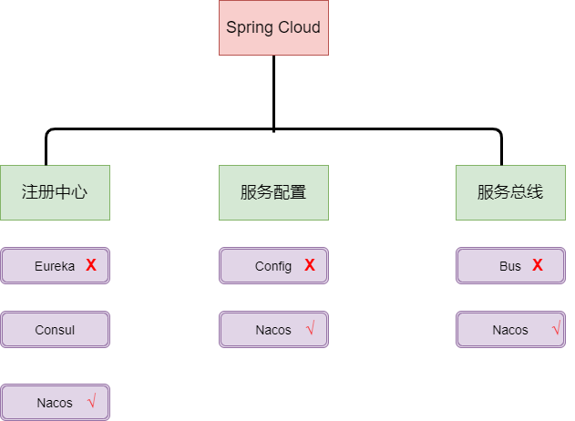

从上图不难看出阿里巴巴的野心，一个Nacos干掉了Spring Cloud的三大组件，分别是`注册中心Eureka`、`服务配置Config`，`服务总线Bus`。

本文目录结构如下图：

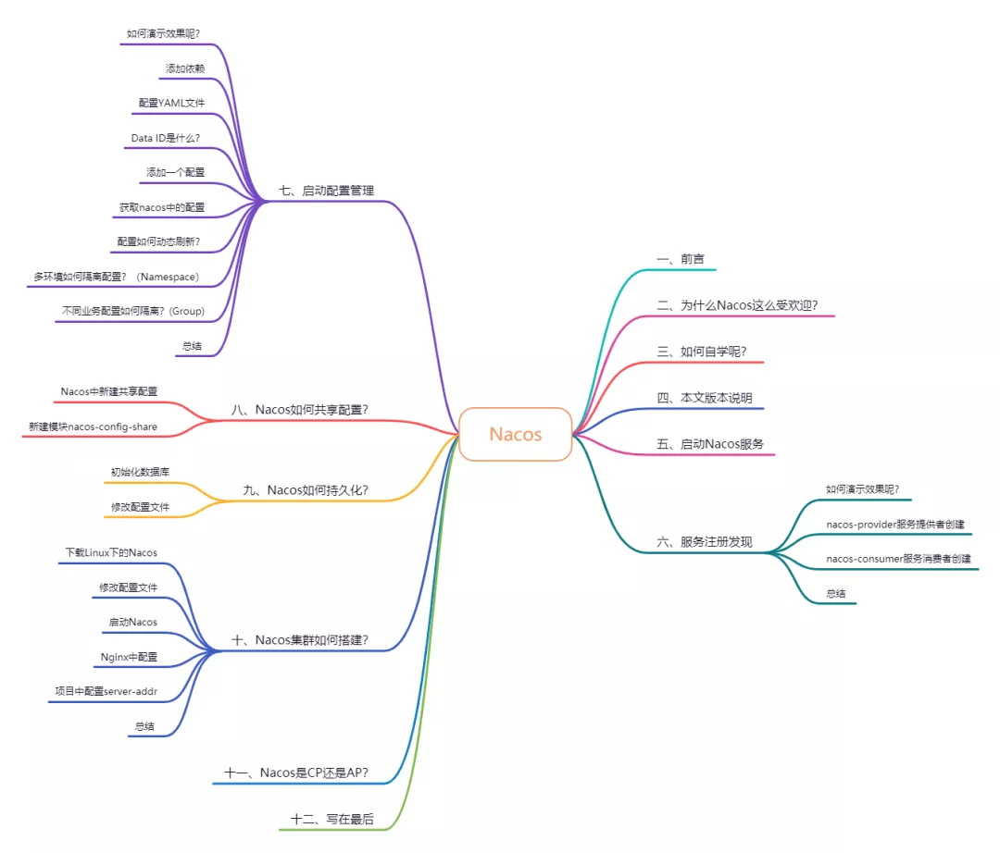

## 为什么Nacos这么受欢迎？

Nacos官方文档的介绍中有这么一句话，如下：

> Nacos 帮助您更敏捷和容易地构建、交付和管理微服务平台。Nacos 是构建以“服务”为中心的现代应用架构 (例如微服务范式、云原生范式) 的服务基础设施。

什么意思呢？不着急，有对比才有伤害。

`Eureka`、`Config`这两个组件相信大家都用过，有什么感受？

当然，这两个组件给我最直观的感受就是繁琐，原因如下：

1. 无论是Eureka还是Config都必须自己搭建个服务
2. 英文界面不是那么友好

用过Nacos的开发者都说很爽，不用自己搭建服务，阿里给你准备好了服务，只需要启动即可；界面中英文都有，很适合初学者。

当然最重要的原因就是以上组件很可能面临`停更`、比如Eureka已经停更了，谁知道后面其他的组件会不会如此呢？

## 如何自学呢？

对于初学者当然是官方文档了，下面作者列出了Nacos相关的官方文档：

- https://nacos.io/zh-cn/docs/what-is-nacos.html（中英文兼备）
- https://spring-cloud-alibaba-group.github.io/github-pages/hoxton/en-us/index.html（英文）
- https://github.com/alibaba/nacos（Nacos项目仓库）

当然很多人不愿意看官方文档，作者也在为大家准备了视频教程。

> 公众号`码猿技术专栏`回复关键词`9527`免费获取。

## 本文版本说明

基于Maven构建的微服务项目，各个组件版本如下：

- JDK1.8+
- Spring Boot-2.2.2.RELEASE
- SpringCloud-Hoxton.SR3
- SpringCloud Alibaba-2.2.1.RELEASE

注意：Spring Boot、Spring Cloud、Spring Cloud Alibaba的版本可不是随便选择的，官网明确规定了各个版本的适配：https://github.com/alibaba/spring-cloud-alibaba/wiki，如下图：

**毕业版本依赖关系(推荐使用)**

下表为按时间顺序发布的 Spring Cloud Alibaba 以及对应的适配 Spring Cloud 和 Spring Boot 版本关系（由于 Spring Cloud 版本命名有调整，所以对应的 Spring Cloud Alibaba 版本号也做了对应变化）

| Spring Cloud Alibaba Version      | Spring Cloud Version        | Spring Boot Version |
| --------------------------------- | --------------------------- | ------------------- |
| 2.2.7.RELEASE                     | Spring Cloud Hoxton.SR12    | 2.3.12.RELEASE      |
| 2021.1                            | Spring Cloud 2020.0.1       | 2.4.2               |
| 2.2.6.RELEASE                     | Spring Cloud Hoxton.SR9     | 2.3.2.RELEASE       |
| 2.1.4.RELEASE                     | Spring Cloud Greenwich.SR6  | 2.1.13.RELEASE      |
| 2.2.1.RELEASE                     | Spring Cloud Hoxton.SR3     | 2.2.5.RELEASE       |
| 2.2.0.RELEASE                     | Spring Cloud Hoxton.RELEASE | 2.2.X.RELEASE       |
| 2.1.2.RELEASE                     | Spring Cloud Greenwich      | 2.1.X.RELEASE       |
| 2.0.4.RELEASE(停止维护，建议升级) | Spring Cloud Finchley       | 2.0.X.RELEASE       |
| 1.5.1.RELEASE(停止维护，建议升级) | Spring Cloud Edgware        | 1.5.X.RELEASE       |

**不同版本的Alibaba也对应了不同组件的版本，如下图：**

每个 Spring Cloud Alibaba 版本及其自身所适配的各组件对应版本（经过验证，自行搭配各组件版本不保证可用）如下表所示（最新版本用*标记）：

**组件版本关系**

| Spring Cloud Alibaba Version                              | Sentinel Version | Nacos Version | RocketMQ Version | Dubbo Version | Seata Version |
| --------------------------------------------------------- | ---------------- | ------------- | ---------------- | ------------- | ------------- |
| 2.2.7.RELEASE*                                            | 1.8.1            | 2.0.3         | 4.6.1            | 2.7.13        | 1.3.0         |
| 2.2.6.RELEASE                                             | 1.8.1            | 1.4.2         | 4.4.0            | 2.7.8         | 1.3.0         |
| 2021.1 or 2.2.5.RELEASE or 2.1.4.RELEASE or 2.0.4.RELEASE | 1.8.0            | 1.4.1         | 4.4.0            | 2.7.8         | 1.3.0         |
| 2.2.3.RELEASE or 2.1.3.RELEASE or 2.0.3.RELEASE           | 1.8.0            | 1.3.3         | 4.4.0            | 2.7.8         | 1.3.0         |
| 2.2.1.RELEASE or 2.1.2.RELEASE or 2.0.2.RELEASE           | 1.7.1            | 1.2.1         | 4.4.0            | 2.7.6         | 1.2.0         |
| 2.2.0.RELEASE                                             | 1.7.1            | 1.1.4         | 4.4.0            | 2.7.4.1       | 1.0.0         |
| 2.1.1.RELEASE or 2.0.1.RELEASE or 1.5.1.RELEASE           | 1.7.0            | 1.1.4         | 4.4.0            | 2.7.3         | 0.9.0         |
| 2.1.0.RELEASE or 2.0.0.RELEASE or 1.5.0.RELEASE           | 1.6.3            | 1.1.1         | 4.4.0            | 2.7.3         | 0.7.1         |

> 一定要完全按照文档给出的版本来选择，不然会出现意想不到的BUG，那岂不是鸡鸡....

作者使用的是分模块的聚合项目演示，其中`dependencyManagement`依赖如下，对应着上文提到的版本：

```xml
<dependencyManagement>
        <dependencies>
            <dependency>
                <groupId>org.springframework.boot</groupId>
                <artifactId>spring-boot-dependencies</artifactId>
                <version>2.2.5.RELEASE</version>
            </dependency>
            <dependency>
                <groupId>org.springframework.cloud</groupId>
                <artifactId>spring-cloud-dependencies</artifactId>
                <version>Hoxton.SR3</version>
                <type>pom</type>
                <scope>import</scope>
            </dependency>
            <dependency>
                <groupId>com.alibaba.cloud</groupId>
                <artifactId>spring-cloud-alibaba-dependencies</artifactId>
                <version>2.2.1.RELEASE</version>
                <type>pom</type>
                <scope>import</scope>
            </dependency>
        </dependencies>
    </dependencyManagement>
```

## 启动Nacos服务

根据上面作者选择的Spring Cloud Alibaba的版本，对应的Nacos版本是`1.2.1`，直接去GitHub(https://github.com/alibaba/nacos/tags)下载对应的版本即可，可以选择windows或者Linux

下载完成之后直接解压即可，从它的目录结构和文件名称一看这就是一个Spring Boot 项目。

进入`/bin`目录，有两个脚本，如下：

- `startup.cmd`：windows平台的启动脚本
- `startup.sh`：Macos Linux平台的启动脚本

在浏览器输入`http://localhost:8848/nacos`进入Nacos的登录界面。

> 用户名：nacos；密码：nacos

登录成功的界面如下：

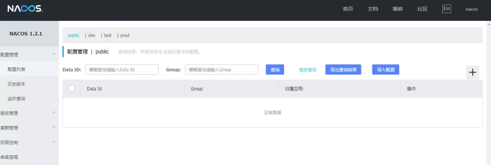

## 服务注册发现

微服务的服务注册和发现相信都用过Eureka，要自己本地构建一个Eureka微服务，但是整合了Alibaba的Nacos则不用那么复杂，直接启动Alibaba提供的Nacos服务即可，这样让程序员把全部精力放在业务上，下面是一个简单的架构图：


### 如何演示效果呢？

参照上面架构图，作者分别创建了两个模块，分别是`nacos-provider`(服务提供者)、`nacos-consumer`(服务消费者)，职责如下：

- `nacos-provider`：注册进入nacos-server，对外暴露服务
- `nacos-consumer`：注册进入nacos-server，调用nacos-provider的服务

### nacos-provider服务提供者创建

由于使用了多模块聚合项目，只需要创建一个nacos-provider模块即可。步骤如下：

#### 1. 添加Maven依赖

需要添加`spring-cloud-starter-alibaba-nacos-discovery`这个依赖，如下

```xml
<dependency>
  <groupId>com.alibaba.cloud</groupId>
  <artifactId>spring-cloud-starter-alibaba-nacos-discovery</artifactId>
</dependency>
```

由于父模板中指定了`spring-cloud-alibaba-dependencies`的版本，子模块中直接引入依赖即可，不需要指定版本号，这样才能达到版本管理的效果。

#### 2. 配置YML文件

在配置文件中指定服务名称、端口号、nacos-server的地址等信息，如下：

```yaml
server:
  port: 9001
spring:
  application:
    ## 指定服务名称，在nacos中的名字
    name: nacos-provider
  cloud:
    nacos:
      discovery:
        # nacos的服务地址，nacos-server中IP地址:端口号
        server-addr: 127.0.0.1:8848
management:
  endpoints:
    web:
      exposure:
        ## yml文件中存在特殊字符，必须用单引号包含，否则启动报错
        include: '*'
```

#### 3. 开启服务注册发现功能

这个大部分Spring Boot功能模块相同，都需要使用`@EnableXxxx`注解来开启某个功能，否则无法引入自动配置。这里需要使用Spring Cloud的原生注解`@EnableDiscoveryClient`来开启服务注册发现的功能，如下：

```java
@SpringBootApplication
@EnableDiscoveryClient
public class NacosDiscoveryApplication {
    public static void main(String[] args) {
        SpringApplication.run(NacosDiscoveryApplication.class, args);
    }
}
```

#### 4. 写个演示服务

nacos-provider作为服务提供者注册到nacos中，肯定需要提供个服务来供消费者（nacos-consumer）调用，下面是随便写的一个接口：

```java
@RestController
@RequestMapping("/nacos")
public class NacosController {
    @GetMapping("/test/{id}")
    public String test(@PathVariable("id")Integer id) {
        return "accept one msg id=" + id;
    }
}
```

#### 5. 启动项目

按照上面的5个步骤算是完成了最基本的一个服务，现在只需要启动nacos-provider这个服务即可。

启动成功之后在nacos的服务管理->服务列表这里将会发现注册进入的nacos-provider这个服务，如下图：

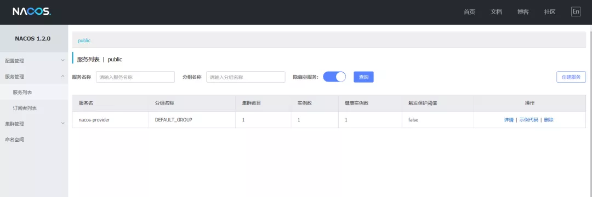

OK，在nacos中能够看到服务注册成功了，完成任务..........

### nacos-consumer服务消费者创建

同样是注册进入nacos，因此大致步骤都是一样的，步骤如下：

#### 1. 添加Maven依赖

需要添加`spring-cloud-starter-alibaba-nacos-discovery`这个依赖，如下图：

```xml
<dependency>
  <groupId>com.alibaba.cloud</groupId>
  <artifactId>spring-cloud-starter-alibaba-nacos-discovery</artifactId>
</dependency>
```

#### 2. 配置YML文件

同样是指定服务名、端口、nacos-server的地址，如下：

```yaml
server:
  port: 9002
spring:
  application:
    name: nacos-consumer
  cloud:
    nacos:
      discovery:
        # nacos的服务地址
        server-addr: 127.0.0.1:8848
management:
  endpoints:
    web:
      exposure:
        ## yml文件中存在特殊字符，必须用单引号包含，否则启动报错
        include: '*'
```

#### 3. 开启服务注册发现功能

使用`@EnableDiscoveryClient`标注，如下图：

```java
@SpringBootApplication
@EnableDiscoveryClient
public class NacosConsumerApplication {
    public static void main(String[] args) {
        SpringApplication.run(NacosConsumeApplication.class, args);
    }
}
```

#### 4. 写个演示服务

如何演示呢？nacos-provider提供了一个服务，那么我们就调用它的服务来演示一把。

其实Nacos集成了Ribbon，何以见得呢？打开`spring-cloud-starter-alibaba-nacos-discovery`的依赖一看便知，如下图：

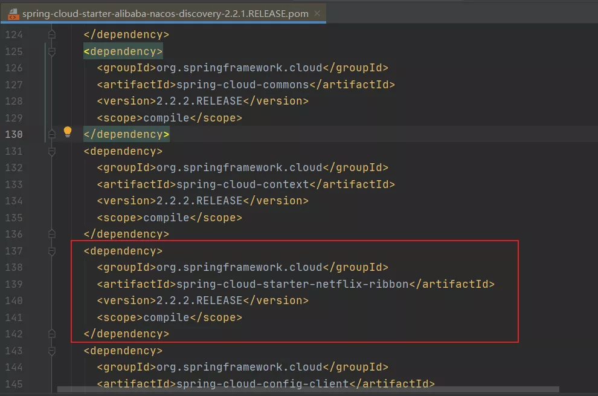

因此我们便能使用Ribbon的负载均衡来调用服务，步骤如下：

- 创建RestTemplate，使用`@LoadBalanced`注解标注开启负载均衡，如下：

```java
@Configuration
public class AutoBeanConfiguration {
    @LoadBalanced
    @Bean
    public RestTemplate restTemplate(){return new RestTemplate();}
}
```

- 直接使用注册到nacos的中的服务名作为访问地址调用服务，如下：

```java
@RestController
@RequestMapping("/nacos")
public class ConsumerController {
    @Autowired
    private RestTemplate restTemplate;
    //获取配置文件中的微服务访问地址
    // 此处的serviceUrl=http://service-name
    @Value("${service-url.nacos-provider}")
    private String serviceUrl;
    @GetMapping("/test/{id}")
    public ResponseEntity<String> test(@PathVariable("id")Integer id){
        return restTemplate.getForEntity(serviceUrl + "/nacos/test/" + id,String.class);

    }
}
```

- 上图中的`serviceUrl`是什么东西呢？难道是IP地址？当然不是，既然nacos-provider和nacos-consumer都已经注册到nacos中，那么可能是可以直接通过服务名直接找到对应得服务，因此这个`serviceUrl=http://service-name`，如下图：

```yaml
service-url:
  nacos-provider: http://nacos-provider
```

OK，至此nacos-consumer已经准备完成，下面就可以启动项目。

#### 5. 启动项目

启动成功之后将会在nacos中的服务列表中查看到两个服务，分别是nacos-provider、nacos-consumer，如下图：

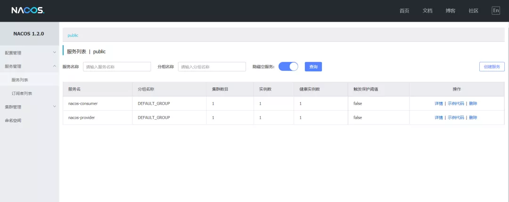

此时服务提供者和消费者都已成功注册到Nacos，那么接下来就是测试服务能否调的通的问题了。

直接调用nacos-consumer的接口，输入地址：`http://localhost:9002/nacos/test/16`，返回信息如下图则表示相互调用成功：


### 总结

Nacos的服务注册发现很简单，比Eureka简单多了，无需自己构建个注册中心。

## 启动配置管理

为什么要用配置管理？其实这已经不仅仅是微服务的痛点了，单体服务也存在这样的痛点。试问线上的项目如果想要的修改某个配置，比如添加一个数据源，难道要停服更新？显然是不太现实，那么如何解决呢？

对于单体应用前面已经写过一篇文章，感兴趣的可以看：[如何让Spring Boot 的配置 "动" 起来？](https://mp.weixin.qq.com/s?__biz=MzU3MDAzNDg1MA==&mid=2247491723&idx=1&sn=4f335dfab579aac6cd40455d88f74fdb&chksm=fcf73f46cb80b6503898214461b5fe173319e46da76d8b5de531db6588a30cb0ccadf53fbdb6&token=1695818683&lang=zh_CN&scene=21#wechat_redirect)

微服务环境下可选的方案还是很多的，比如Config+BUS，携程开源的Apollo....

这都不是今天的重点，用过Config+BUS觉得怎么样？自己要搭建一个Config微服务，还要集成GitHub等，你不难受吗？

下面就来介绍一下Nacos是如何完美的实现配置管理以及动态刷新的。

### 如何演示效果呢？

新建一个模块`nacos-config`用来整合Nacos实现配置管理，项目结构如下：

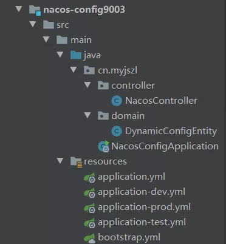

Nacos配置列表在哪里能看到呢？在管理平台->配置管理->配置列表这一栏，如下图：


### 添加依赖

由于使用了模块聚合的工程，因此不需要指定版本号，依赖如下：

```
<dependency>
      <groupId>com.alibaba.cloud</groupId>
      <artifactId>spring-cloud-starter-alibaba-nacos-config</artifactId>
    </dependency>
```

### 配置YAML文件

在`bootstrap.yml`文件中设置Nacos的配置，如下：

```yaml
spring:
  application:
    name: nacos-config
    ## 当前环境，这个和dataId有关-> ${prefix}-${spring.profiles.active}.${file-extension}
  profiles:
    active: dev
  cloud:
    nacos:
      config:
        ## nacos的地址，作为配置中心
        server-addr: 127.0.0.1:8848
        ## 配置内容的数据格式，目前只支持 properties 和 yaml 类型，这个和dataId有关-> ${prefix}-${spring.profiles.active}.${file-extension}
        file-extension: properties
management:
  endpoints:
    web:
      exposure:
        ## yml文件中存在特殊字符，必须用单引号包含，否则启动报错
        include: '*'
```

### Data ID是什么？

dataId是一个配置的唯一标识，怎么取值呢？格式如下：

```yaml
${prefix}-${spring.profiles.active}.${file-extension}
```

- `prefix`：前缀，默认是`spring.application.name`的值，也可以通过配置项 `spring.cloud.nacos.config.prefix`来配置。
- `spring.profiles.active`：即为当前环境对应的 profile。当 `spring.profiles.active` 为空时，对应的连接符 `-` 也将不存在，dataId 的拼接格式变成 `${prefix}.${file-extension}`
- `file-exetension` 为配置内容的数据格式，可以通过配置项 `spring.cloud.nacos.config.file-extension` 来配置。目前只支持 `properties` 和 `yaml` 类型。

### 添加一个配置

下面在nacos中添加一个`config.version`的配置，如下图：

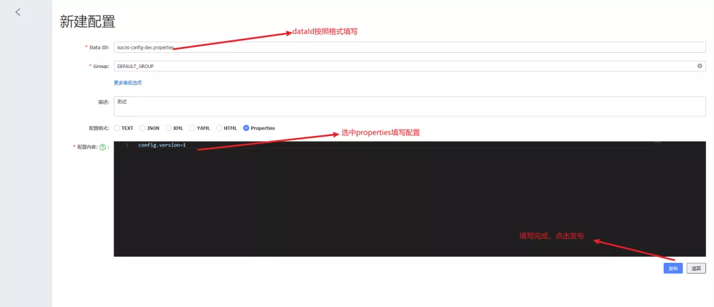

以上就是添加的`config.version`的配置，发布之后查看列表如下图：


### 获取nacos中的配置

获取nacos中的配置很简单，使用原生注解`@Value()`直接读取即可，步骤如下：

- 新建一个实体类`DynamicConfigEntity`：

```java
@Component
@Data
public class DynamicConfigEntity {
    //直接读取nacos中config.version的配置
    @Value("${config.version}")
    private String version;
}
```

- 新建一个controller测试，如下：

```java
@RestController
@RequestMapping("/nacos")
public class NacosController {
    @Autowired
    private DynamicConfigEntity entity;

    @GetMapping("/test/{id}")
    public String test(@PathVariable("id")Integer id){
        return "accept one msg id="+id+"----- version="+entity.getVersion();
    }
}
```

运行项目成功后，在浏览器输入地址：http://localhost:9003/nacos/test/1，返回如下结果：


结果很明显，Nacos中的配置生效了，是不是很简单？

### 配置如何动态刷新？

设想一下：现在由于需求改变了，我需要将`config.version`这个配置改成2，那么我直接改变Nacos中的配置会生效吗？

不妨试一下，直接将Nacos中的配置修改成2，如下图：

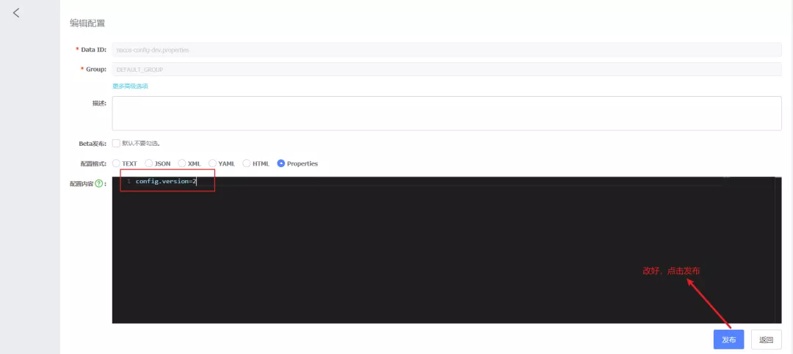

此时我们再不重启项目的情况下访问：http://localhost:9003/nacos/test/1，结果如下图：


what？？？怎么没变呢？不是说Nacos可以自动刷新配置吗？

其实想要Nacos自动刷新配置还需要结合原生注解`@RefreshScope`，这个注解是不是很眼熟，在Config中也是用这个注解刷新配置，我们只需要将该注解标注在配置的实体类上即可，如下：

```java
@Component
@RefreshScope
@Data
public class DynamicConfigEntity {

    //直接读取nacos中config.version的配置
    @Value("${config.version}")
    private String version;
}
```

此时加上`@RefreshScope`重启之后将Nacos中`config.version`这个配置改成3，然后访问http://localhost:9003/nacos/test/1，结果如下图：


### 多环境如何隔离配置？（Namespace）

试想一下：正常的业务开发至少有三个环境吧，如下：

- dev：本地开发环境
- test：测试环境
- prod：生产环境

那么每个环境的配置肯定是不同的，那么问题来了，如何将以上三种不同的配置在Nacos能够很明显的区分呢？

很多人可能会问：`DataId`格式中不是有环境的区分吗？这个不是可以满足吗？

`DataId`当然能够区分，但是微服务配置可不止这几个啊？一旦多了你怎么查找呢？多种环境的配置杂糅到一起，你好辨别吗？

当然阿里巴巴的Nacos开发团队显然考虑到了这种问题，官方推荐用命名空间（namespace）来解决环境配置隔离的问题。

> Namespace（命名空间）：解决多环境及多租户数据的隔离问题 在多套不同的环境下，可以根据指定的环境创建不同的Namespace，实现多环境的数据隔离

Nacos中默认提供的命名空间则是`public`，上述我们创建的`config.version`这个配置就属于`public`这个命名空间，如下图：


当然我们可以根据业务需要创建自己的命名空间，操作如下图：

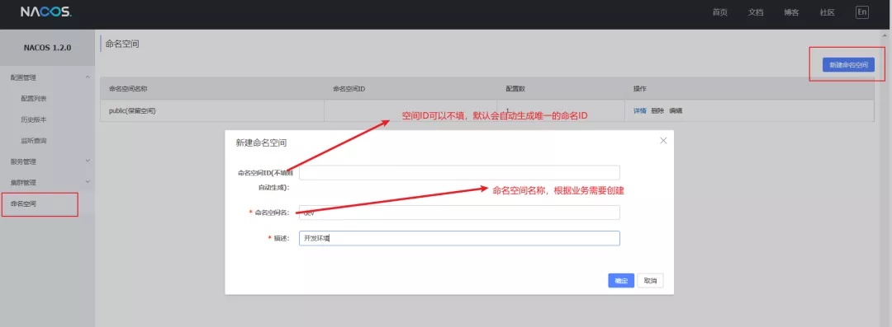

陈某创建了三个，分别是dev、test、prod，如下图：


> 注意：上图中的`命名空间ID`是系统自动生成的唯一ID，后续指定不同的Namespace就用这个ID。

创建完成之后，在配置列表上方则可以看见不同的命名空间，如下图：


既然Nacos中的Namespace配置好了，那么微服务中如何配置呢？前面也说过，Nacos默认指定的命名空间是`public`，那么如何在项目中指定命名空间呢？

其实很简单，假设在`test`这个命名空间中添加一个`config.version=4`，如下图：


此时只需要在`bootstrap.yml`配置中指定如下配置：

```
spring:
  application:
    name: nacos-config
  cloud:
    nacos:
      config:
      ## namespace的取值是命名空间ID，这里取的是test命名空间ID
        namespace: d0ffeec2-3deb-4540-9664-fdd77461fd6b
```

> 注意：Namespace必须在`bootstrap.yml`配置文件中指定，否则不生效。

至此，已经全部配置完毕，启动项目，浏览器访问http://localhost:9003/nacos/test/1，结果如下图：


### 不同业务配置如何隔离？(Group)

试想以下场景：有两个微服务，一个是订单系统，一个是用户系统，但是他们有着相同的配置，比如`datasource-url`，那么如何区分呢？

此时Group就派上用场了，顾名思义Group是分组的意思。

> Group：Nacos 中的一组配置集，是组织配置的维度之一，简单的说则是不同的系统或微服务的配置文件可以放在一个组里。Nacos如果不指定Group，则默认的分组是DEFAULT_GROUP。

上述场景中订单系统、用户系统可以单独分为一个组，比如`ORDER_GROUP`、`USER_GROUP`。当然这是比较细粒度的分组，根据企业的业务也可以多个微服务分为一组。

下面在Nacos中新建一个`config.version=5`，命名空间为`test`，分组为`ORDER_GROUP`，如下图：

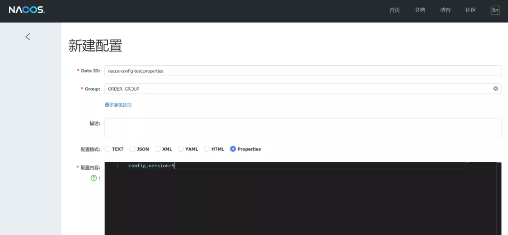

此时命名空间`test`中的配置如下图：


在`bootstrap.yml`配置文件中指定分组，配置如下：

```
spring:
  application:
    name: nacos-config
  cloud:
    nacos:
      config:
        ## 指定命名空间
        namespace: d0ffeec2-3deb-4540-9664-fdd77461fd6b
        ## 指定分组为ORDER_GROUP
        group: ORDER_GROUP
```

> 注意：Group配置和Namespace一样，要在`bootstrap.yml`文件中配置。

至此，已经全部配置完毕，启动项目，浏览器访问http://localhost:9003/nacos/test/1，结果如下图：


### 总结

Nacos实现配置管理和动态配置刷新很简单，总结如下步骤：

1. 添加对应`spring-cloud-starter-alibaba-nacos-config`依赖
2. 使用原生注解`@Value()`导入配置
3. 使用原生注解`@RefreshScope`刷新配置
4. 根据自己业务场景做好多环境配置隔离(Namespace)、不同业务配置隔离(Group)
5. 切记：命名空间和分组的配置一定要放在`bootstrap.yml`或者`bootstrap.properties`配置文件中

## Nacos如何共享配置？

场景：一个项目的微服务数量逐渐增多，势必会有相同的配置，那么我们可以将相同的配置抽取出来作为项目中共有的配置，比如集群中的数据源信息..

Nacos的共享配置能够完美的解决上述问题，配置起来也是很简单，没办法，就是这么强大。

### Nacos中新建共享配置

陈某这里演示两个共享配置，`DataId`分别是`share-config1.properties`，`share-config2.properties`，如下图：

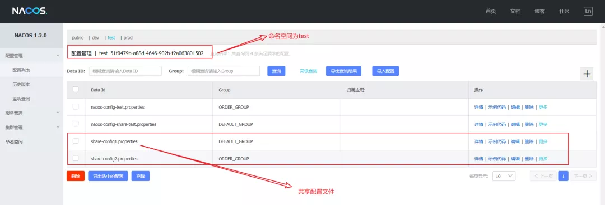

> 注意：`DataId`一定要带有后缀`properties`或者`yml`

`share-config1.properties`配置中的内容如下：

```yaml
database.url=jdbc:mysql://112.111.0.135:3306/nacos_config?characterEncoding=utf8&connectTimeout=1000&socketTimeout=3000&autoReconnect=true
```

`share-config2.properties`配置中的内容如下：

```yaml
database.user=root
```

### 新建模块nacos-config-share

此处新建一个模块nacos-config-share来演示效果，依赖同`nacos-config`

`bootstrap.yml`配置如下：

```yaml
spring:
  application:
    name: nacos-config-share
  cloud:
    nacos:
      config:
        ## 指定命名空间
        namespace: 51f0479b-a88d-4646-902b-f2a063801502
        ## nacos的地址，作为配置中心
        server-addr: 127.0.0.1:8848
        ## 配置内容的数据格式，目前只支持 properties 和 yaml 类型，这个和dataId有关-> ${prefix}-${spring.profiles.active}.${file-extension}
        file-extension: properties
management:
  endpoints:
    web:
      exposure:
        ## yml文件中存在特殊字符，必须用单引号包含，否则启动报错
        include: '*'
```

以上的配置和`nacos-config`差不多，指定`application.name`、命名空间、`file-extension`、nacos服务地址....

当然除了以上配置肯定是不够的，要想共享配置还需要添加以下配置：

```yaml
spring:
  application:
    name: nacos-config-share
  cloud:
    nacos:
      config:
        ## 共享配置，List集合，可以配置多个
        shared-configs:
          ## dataId：配置文件的dataId，必须带有后缀
          - dataId: share-config1.properties
          ## refresh：指定是否能够动态刷新，默认是false
            refresh: true
          - dataId: share-config2.properties
          ## 指定配置文件的分组，默认是DEFAULT_GROUP
            group: ORDER_GROUP
            refresh: true
```

想要看到效果，肯定是需要通过`@Value()`导入配置，如下：

```java
@Component
@RefreshScope
@Data
public class DynamicConfigEntity {
    //获取共享配置文件中database.url
    @Value("${database.url}")
    private String databaseUrl;

    //获取共享配置文件中database.user
    @Value("${database.user}")
    private String user;
}
```

上面配置完毕，启动nacos-config-share这个项目，访问：http://localhost:9003/nacos/test/1，结果如下图：


动态刷新配置这里就不再演示了，自己动手玩一下......

## Nacos如何持久化？

前面讲了这么多，大家有没有思考过一个问题，Nacos的一系列的配置究竟存储在哪里呢？

其实Nacos默认使用的是内嵌的数据库`Derby`，这个在Nacos-server文件下的`/data`目录下就可以验证

那么问题来了，这些配置如何用自己的数据库存储呢？

> 目前Nacos仅支持`Mysql`数据库，且版本要求：`5.6.5+`

### 初始化数据库

首先在Mysql中新建一个数据库`nacos-config`（名称随意），然后执行Nacos中的SQL脚本，该脚本是Nacos-server文件夹中的`nacos-mysql.sql`

执行该脚本，将会自动创建表

### 修改配置文件

Nacos-server也是一个Spring Boot 项目，想要连接自己的数据库，当然要配置数据源了，那么在哪里配置呢？

配置文件同样在Nacos-server中的conf目录下

只需要将`application.properties`中的Mysql配置取消注释并且配置好自己的数据源即可，如下图：

修改完毕，重新启动Nacos-server。

如何验证是否持久化呢？很简单，只需要创建一个配置，然后在`his_config_info`表中查看下是否存在即可

## Nacos集群如何搭建？

真是够了，又来扯皮高可用了，真是头大..........

Nacos推荐集群模式部署，这样可以避免单点故障，那么如何搭建集群呢？请看官方文档：https://nacos.io/zh-cn/docs/cluster-mode-quick-start.html

架构图如下

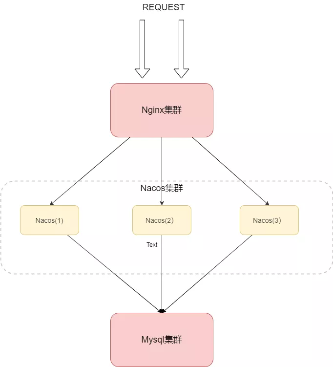

请求进来先共同Nginx集群进行转发到Nacos集群中，当然为了保持高可用，数据库必须也是集群模式。

Nacos官方推荐Linux下搭建集群模式，因此陈某尝试在Linux环境下搭建。Nginx和Mysql这里集群就不再演示如何搭建了，不是今天的重点，主要演示下Nacos集群的搭建方法。

### 下载Linux下的Nacos

在GitHub上下载自己对应的版本，陈某用的版本是1.2.1，地址：https://github.com/alibaba/nacos/releases/tag/1.2.1

找到后缀为`tar.gz`的文件下载，如下图：

### 修改配置文件

由于条件限制，陈某仅仅在一台服务器上启动三个Nacos服务演示。Nacos的端口分别为8848、8849、8850。

#### 修改端口号

Nacos默认的端口号是8848，那么如何修改端口呢？只需要修改`conf`目录下的`application.properties`中的`server.port`即可，如下图：

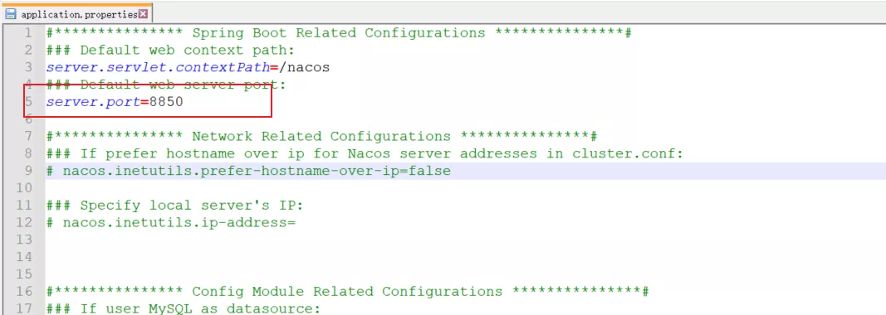

#### 修改集群配置

那么如何配置集群呢？在`conf`目录下有一个`cluster.conf.example`文件，如下图：


只需要将`cluster.conf.example`这个文件复制一份为`cluster.conf`放在`conf`目录下，其中配置的内容如下：

```bash
172.16.1.84:8848
172.16.1.84:8849
172.16.1.84:8850
```

什么意思呢？`172.16.1.84`是服务器的IP地址，这里填写自己服务器的IP，`:`后面的是Nacos的端口号。

#### 修改数据源

这个在持久化的那里已经讲过了，只需要将`application.properties`中的数据源替换掉，如下图：


### 启动Nacos

经过上述的步骤Nacos集群已经配置好了，现在分别启动Nacos，命令如下：

```bash
bash -f ./startup.sh
```

启动成功，访问任意一个端口的Nacos服务，在`集群管理->节点列表`中将会看到自己搭建的三个节点，如下图：


至此，Nacos集群算是搭建完成了......

### Nginx中配置

此处就不演示Nginx集群搭建了，直接在单机的Nginx中配置。直接修改nginx的conf文件，内容如下：

```nginx
upstream nacos{
		server 172.16.1.84:8848;
		server 172.16.1.84:8849;
		server 172.16.1.84:8850;
	 }
	 
	 server{
		listen 80;
		location / {
			proxy_pass http://nacos;
		}
	 }
```

相信大家都能看懂，此处就不再做过多解释了.....配置完成后，启动Nginx，直接访问：http://ip/nacos。

### 项目中配置server-addr

既然搭建了集群，那么项目中也要配置一下，有两种方式，下面分别介绍。

第一种：通过直连的方式配置，如下：

```yaml
spring:
  application:
    ## 指定服务名称，在nacos中的名字
    name: nacos-provider
  cloud:
    nacos:
      discovery:
        # nacos的服务地址，nacos-server中IP地址:端口号
        server-addr: 172.16.1.84:8848,172.16.1.84:8849,172.16.1.84:8850
```

第二种：直接连接Nginx，如下：

```yaml
spring:
  application:
    ## 指定服务名称，在nacos中的名字
    name: nacos-provider
  cloud:
    nacos:
      discovery:
        # nacos的服务地址，nacos-server中IP地址:端口号
        server-addr: 172.16.1.84:80
```

### 总结

Nacos集群搭建非常简单，唯一的配置就是`cluster.conf`中设置三个Nacos服务，这也正是Nacos的设计理念，让开发者能够尽快上手，专注业务的开发。

## Nacos是CP还是AP？

先来简单复习下CAP的概念吧，如下：

- 一致性（C）：在分布式系统中的所有数据备份，在同一时刻是否同样的值。（等同于所有节点访问同一份最新的数据副本）
- 可用性（A）：在集群中一部分节点故障后，集群整体是否还能响应客户端的读写请求。（对数据更新具备高可用性）
- 分区容错性（P）：以实际效果而言，分区相当于对通信的时限要求。系统如果不能在时限内达成数据一致性，就意味着发生了分区的情况，必须就当前操作在C和A之间做出选择。

一般分布式系统中，肯定是优先保证P，剩下的就是C和A的取舍。


当然不同的注册中心遵循的CAP也是不同的，如下：

- Zookeeper：保证CP，放弃可用性；一旦zookeeper集群中master节点宕了，则会重新选举leader，这个过程可能非常漫长，在这过程中服务不可用。
- Eureka：保证AP，放弃一致性；Eureka集群中的各个节点都是平等的，一旦某个节点宕了，其他节点正常服务（一旦客户端发现注册失败，则将会连接集群中其他节点），虽然保证了可用性，但是每个节点的数据可能不是最新的。
- Nacos：同时支持CP和AP，默认是AP，可以切换；AP模式下以临时实例注册，CP模式下服务永久实例注册。