## 1、前言

这是《Spring Cloud 进阶》专栏的第五篇文章，这篇文章介绍一下阿里开源的流量防卫兵Sentinel，一款非常优秀的开源项目，经过近10年的双十一的考验，非常成熟的一款产品。

> Sentinel官方文档: https://sentinelguard.io/zh-cn/docs/introduction.html

## 2、什么是sentinel？

sentinel顾名思义：卫兵；在Redis中叫做**哨兵**，用于监控主从切换，但是在微服务中叫做**流量防卫兵**。

Sentinel 以流量为切入点，从**流量控制**、**熔断降级**、**系统负载**保护等多个维度保护服务的稳定性。

Sentinel 具有以下特征:

- **丰富的应用场景**：Sentinel 承接了阿里巴巴**近 10 年的双十一**大促流量的核心场景，例如秒杀（即突发流量控制在系统容量可以承受的范围）、消息削峰填谷、集群流量控制、实时熔断下游不可用应用等。
- **完备的实时监控**：Sentinel 同时提供实时的监控功能。您可以在控制台中看到接入应用的单台机器秒级数据，甚至 500 台以下规模的集群的汇总运行情况。
- **广泛的开源生态**：Sentinel 提供开箱即用的与其它开源框架/库的整合模块，例如与 Spring Cloud、Apache Dubbo、gRPC、Quarkus 的整合。您只需要引入相应的依赖并进行简单的配置即可快速地接入 Sentinel。同时 Sentinel 提供 Java/Go/C++ 等多语言的原生实现。
- **完善的 SPI 扩展机制**：Sentinel 提供简单易用、完善的 SPI 扩展接口。您可以通过实现扩展接口来快速地定制逻辑。例如定制规则管理、适配动态数据源等。

**Sentinel 的主要特性如下图**：


**Sentinel 分为两个部分**:

- 核心库（Java 客户端）不依赖任何框架/库，能够运行于所有 Java 运行时环境，同时对 Dubbo / Spring Cloud 等框架也有较好的支持。
- 控制台（Dashboard）基于 Spring Boot 开发，打包后可以直接运行，不需要额外的 Tomcat 等应用容器。

**总之一句话：sentinel真牛逼，完爆Hystrix.........**

## 3、sentinel和Hystrix有何区别？

不多说了，总之一句话：Hystrix赶紧放弃，用sentinel......

具体区别如下表：

|                | Sentinel                                       | Hystrix                       |
| -------------- | ---------------------------------------------- | ----------------------------- |
| 隔离策略       | 信号量隔离                                     | 线程池隔离/信号量隔离         |
| 熔断降级策略   | 基于响应时间或失败比率                         | 基于失败比率                  |
| 实时指标实现   | 滑动窗口                                       | 滑动窗口（基于RxJava)         |
| 规则配置       | 支持多种数据源                                 | 支持多种数据源                |
| 扩展性         | 多个扩展点                                     | 插件的形式                    |
| 基于注解的支持 | 支持                                           | 支持                          |
| 限流           | 基于QPS，支持基于调用关系的限流                | 有限的支持                    |
| 流量整形       | 支持慢启动、匀速器模式                         | 不支持                        |
| 系统负载保护   | 支持                                           | 不支持                        |
| 控制台         | 开箱即用，可配置规则、查看秒级监控、机器发现等 | 不完善                        |
| 常见框架的适配 | servlet、SpringCloud、Dubbo、gRPC等            | Servlet、Spring Cloud Netflix |

## 4、sentinel版本如何选择？

由于陈某写的是Spring Cloud 进阶一个系列，使用的聚合项目，因此版本还是保持和之前文章一样，不清楚的可以看这篇：[五十五张图告诉你微服务的灵魂摆渡者Nacos究竟有多强？](https://mp.weixin.qq.com/s?__biz=MzU3MDAzNDg1MA==&mid=2247493854&idx=1&sn=4b3fb7f7e17a76000733899f511ef915&scene=21#wechat_redirect)

这里选择的`spring-cloud-alibaba-dependencies`的版本是`2.2.1.RELEASE`，因此sentinel版本选择`1.7.1`，大家可以根据自己的版本选择对应sentinel的版本，版本对应关系如下图：

**组件版本关系**

| Spring Cloud Alibaba Version                              | Sentinel Version | Nacos Version | RocketMQ Version | Dubbo Version | Seata Version |
| --------------------------------------------------------- | ---------------- | ------------- | ---------------- | ------------- | ------------- |
| 2.2.7.RELEASE*                                            | 1.8.1            | 2.0.3         | 4.6.1            | 2.7.13        | 1.3.0         |
| 2.2.6.RELEASE                                             | 1.8.1            | 1.4.2         | 4.4.0            | 2.7.8         | 1.3.0         |
| 2021.1 or 2.2.5.RELEASE or 2.1.4.RELEASE or 2.0.4.RELEASE | 1.8.0            | 1.4.1         | 4.4.0            | 2.7.8         | 1.3.0         |
| 2.2.3.RELEASE or 2.1.3.RELEASE or 2.0.3.RELEASE           | 1.8.0            | 1.3.3         | 4.4.0            | 2.7.8         | 1.3.0         |
| 2.2.1.RELEASE or 2.1.2.RELEASE or 2.0.2.RELEASE           | 1.7.1            | 1.2.1         | 4.4.0            | 2.7.6         | 1.2.0         |
| 2.2.0.RELEASE                                             | 1.7.1            | 1.1.4         | 4.4.0            | 2.7.4.1       | 1.0.0         |
| 2.1.1.RELEASE or 2.0.1.RELEASE or 1.5.1.RELEASE           | 1.7.0            | 1.1.4         | 4.4.0            | 2.7.3         | 0.9.0         |
| 2.1.0.RELEASE or 2.0.0.RELEASE or 1.5.0.RELEASE           | 1.6.3            | 1.1.1         | 4.4.0            | 2.7.3         | 0.7.1         |

> **注意**：一定要按照官方推荐的版本适配，否则出现意想不到的BUG追悔莫及.........

## 5、Sentinel 控制台如何安装？

sentinel和**nacos**一样，都有一个控制台，但是这里不用自己手动搭建一个微服务，官方已经搭建好了，只需要下载对应得jar包运行即可。下载地址：https://github.com/alibaba/Sentinel/tags

选择对应得版本下载即可，我这里选择`1.7.1`版本，下载的jar包如下图：


> 当然你可以通过源码构建：mvn clean package

**注意**：JDK版本必须`>=1.8`

此时我们只需要运行这个jar包即可，命令如下：

```bash
java -Dserver.port=8080 -Dcsp.sentinel.dashboard.server=localhost:8080 -Dproject.name=sentinel-dashboard -jar sentinel-dashboard-1.7.1.jar
```

上述参数含义如下：

- `-Dserver.port`：指定启动的端口，默认`8080`
- `-Dproject.name`：指定本服务的名称
- `-Dcsp.sentinel.dashboard.server`：指定sentinel控制台的地址，用于将自己注册进入实现监控自己

启动成功之后，浏览器访问：http://localhost:8080，登录页面如下图：

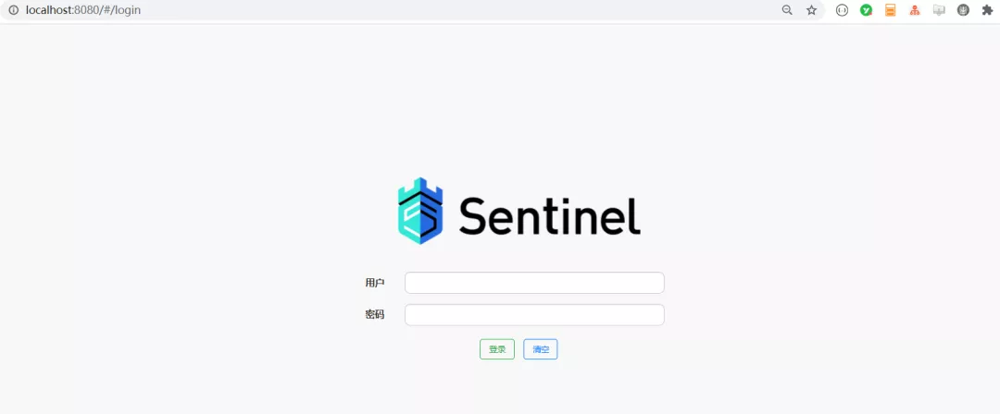

> 默认的用户名和密码：sentinel/sentinel

登录成功之后页面如下：


可以看到目前只有一个服务`sentinel-dashboard`被监控了，**这个服务就是自己**。

> **注意**：上述参数都是可选的，没必要可以不填。

那么问题来了：**默认的用户名和密码在生产环境上肯定不能用，如何修改呢？**

从 Sentinel 1.6.0 起sentinel已经支持自定义用户名和密码了，只需要在执行jar命令时指定即可，命令如下：

```bash
java -Dsentinel.dashboard.auth.username=admin -Dsentinel.dashboard.auth.password=123 -jar sentinel-dashboard-1.7.1.jar
```

用户可以通过如下参数进行配置：

- `-Dsentinel.dashboard.auth.username=sentinel` 用于指定控制台的登录用户名为 `sentinel`；
- `-Dsentinel.dashboard.auth.password=123456` 用于指定控制台的登录密码为 `123456`；如果省略这两个参数，默认用户和密码均为 `sentinel`；
- `-Dserver.servlet.session.timeout=7200` 用于指定 Spring Boot 服务端 session 的过期时间，如 `7200` 表示 7200 秒；`60m` 表示 60 分钟，默认为 30 分钟；

> **注意**：部署多台控制台时，session 默认不会在各实例之间共享，这一块需要自行改造。

除了用户名密码相关的配置，sentinel控制台还提供了其他的可配置选项，如下：

| 配置项                                                       | 类型    | 默认值                    | 最小值 | 描述                                                         |
| ------------------------------------------------------------ | ------- | ------------------------- | ------ | ------------------------------------------------------------ |
| auth.enabled                                                 | boolean | true                      | -      | 是否开启登录鉴权，仅用于日常测试，生产上不建议关闭           |
| sentinel.dashboard.auth.username                             | String  | sentinel                  | -      | 登录控制台的用户名，默认为 `sentinel`                        |
| sentinel.dashboard.auth.password                             | String  | sentinel                  | -      | 登录控制台的密码，默认为 `sentinel`                          |
| sentinel.dashboard.app.hideAppNoMachineMillis                | Integer | 0                         | 60000  | 是否隐藏无健康节点的应用，距离最近一次主机心跳时间的毫秒数，默认关闭 |
| sentinel.dashboard.removeAppNoMachineMillis                  | Integer | 0                         | 120000 | 是否自动删除无健康节点的应用，距离最近一次其下节点的心跳时间毫秒数，默认关闭 |
| sentinel.dashboard.unhealthyMachineMillis                    | Integer | 60000                     | 30000  | 主机失联判定，不可关闭                                       |
| sentinel.dashboard.autoRemoveMachineMillis                   | Integer | 0                         | 300000 | 距离最近心跳时间超过指定时间是否自动删除失联节点，默认关闭   |
| sentinel.dashboard.unhealthyMachineMillis                    | Integer | 60000                     | 30000  | 主机失联判定，不可关闭                                       |
| [server.servlet.session.cookie.name](http://server.servlet.session.cookie.name/) | String  | sentinel_dashboard_cookie | -      | 控制台应用的 cookie 名称，可单独设置避免同一域名下 cookie 名冲突 |

## 6、微服务如何接入sentinel控制台？

微服务为什么要集成sentinel控制台，sentinel不是提供了相关的API吗？

其实Spring Boot 官方一直提倡**约定>配置>编码**的规则，能够不硬编码何乐而不为呢？

因此本文后续内容主要还是结合sentinel控制台进行讲解，关于API的使用大家可以按照官方文档学习，讲解的非常清楚。

好了，言归正传，微服务如何接入sentinel控制台呢？

### 1、新建微服务模块注册进入Nacos

这里的注册中心依然使用的是nacos，有不会用的请看专栏第一篇Nacos文章：[五十五张图告诉你微服务的灵魂摆渡者Nacos究竟有多强？](https://mp.weixin.qq.com/s?__biz=MzU3MDAzNDg1MA==&mid=2247493854&idx=1&sn=4b3fb7f7e17a76000733899f511ef915&scene=21#wechat_redirect)

新建一个微服务模块：**sentinel-service9008**，相关代码不贴出了。

相关配置如下：

```yaml
server:
  port: 9008
spring:
  application:
    ## 指定服务名称，在nacos中的名字
    name: sentinel-service
  cloud:
    nacos:
      discovery:
        # nacos的服务地址，nacos-server中IP地址:端口号
        server-addr: 127.0.0.1:8848
management:
  endpoints:
    web:
      exposure:
        ## yml文件中存在特殊字符，必须用单引号包含，否则启动报错
        include: '*'
```

> 源码全部会上传，获取方式看文末！

### 2、添加依赖

除了Nacos的依赖，还需要添加一个sentinel的依赖：

```xml
<!--sentinel的依赖-->
<dependency>
 <groupId>com.alibaba.cloud</groupId>
 <artifactId>spring-cloud-starter-alibaba-sentinel</artifactId>
</dependency>
```

> 以上只贴出了sentinel相关依赖，nacos依赖不再贴了，见源码！

### 3、添加配置集成控制台

只需要添加如下配置即可集成sentinel控制台：

```yaml
spring:
  cloud:
    sentinel:
      transport:
       ## 指定控制台的地址，默认端口8080
        dashboard: localhost:8080
```

### 4、新建一个测试接口

下面新建一个测试接口，用于测试相关规则，如下：

```java
@RestController
@RequestMapping("/sentinel")
public class FlowLimitController {

    @GetMapping("/test")
    public String test(){
        return "接收到一条消息--------";
    }
}
```

### 5、启动微服务

启动9008这个微服务，然后浏览器输入：`http://localhost:9008/sentinel/test`，此时查看sentinel控制台，将会看见**sentinel-service**这个服务已经被监控了，如下图：

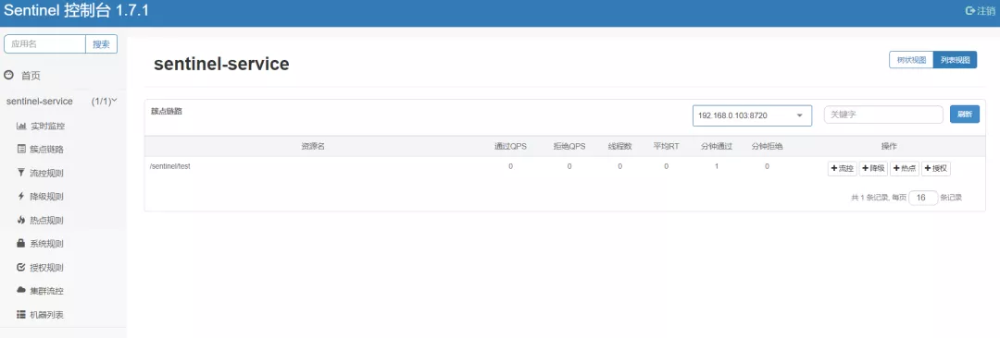

**注意**：sentinel是**懒加载**机制，只有访问过一次的资源才会被监控。

不过可以通过配置关闭懒加载，在项目启动时就连接sentinel控制台，配置如下：

```yaml
spring:
    sentinel:
      # 取消控制台懒加载，项目启动即连接Sentinel
      eager: true
```

## 7、流量控制如何配置？

**流量控制**（flow control），其原理是监控应用流量的 **QPS** 或**并发线程数**等指标，当达到指定的**阈值**时对流量进行控制，以避免被瞬时的流量高峰冲垮，从而保障应用的**高可用性**。

> **QPS**：每秒请求数，即在不断向服务器发送请求的情况下，服务器每秒能够处理的请求数量。

> **并发线程数**：指的是施压机施加的同时请求的线程数量。

同一个资源可以创建多条限流规则，一条限流规则由以下元素组成：

- **resource**：资源名，即限流规则的作用对象。
- **count**：  限流阈值
- **grade**：限流阈值类型（1：QPS  0：并发线程数），默认值QPS
- **limitApp**：流控针对的调用来源，若为 `default` 则不区分调用来源，默认值default
- **strategy**：判断的根据是资源自身**(0)**，还是根据其它关联资源 \**(1)\**，还是根据链路入口**(2)**，默认值根据资源本身。
- **controlBehavior**：  流控效果（直接拒绝(0) / 排队等待(2) / 预热冷启动(1))，默认值直接拒绝。

以上元素限流元素对应的类是`com.alibaba.csp.sentinel.slots.block.flow.FlowRule`，各元素如下图：

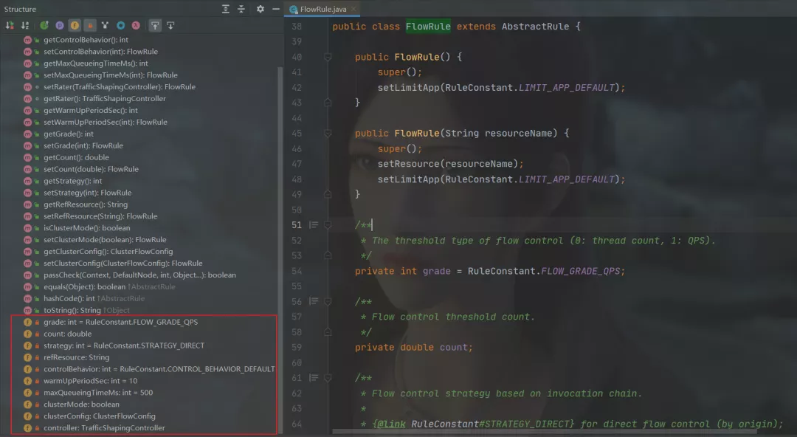

> **注意**：各个元素的取值以及默认值一定要记住，后续配置将会用到。

以上几个元素在sentinel控制台对应规则如下图：

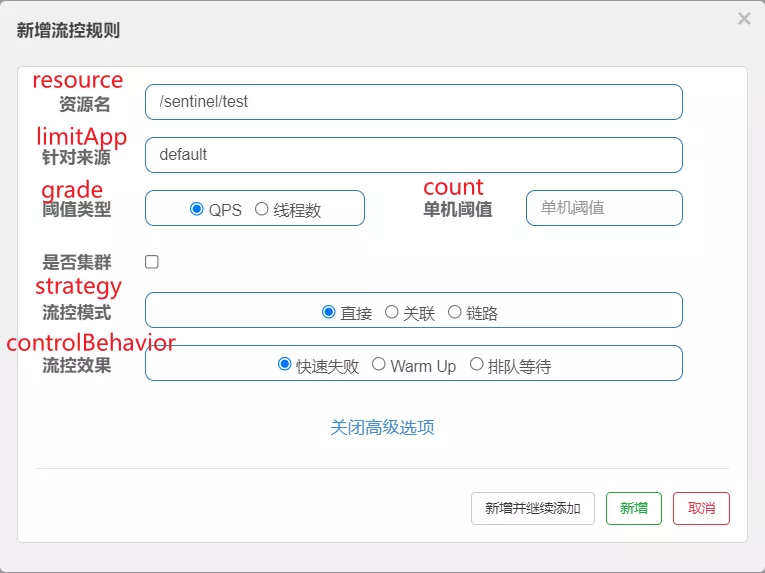

### 1、三种流控效果

流控效果总共分为三种，对应元素`controlBehavior`，分别如下：

#### 快速失败

默认的流量控制方式，当QPS超过任意规则的阈值后，新的请求就会被立即拒绝，拒绝方式为抛出`FlowException`。

#### warm up

即**预热/冷启动**方式。当系统长期处于低水位的情况下，当流量突然增加时，直接把系统拉升到高水位可能瞬间把系统压垮。通过"冷启动"，让通过的流量**缓慢增加**，在**一定时间内**逐渐增加到**阈值上限**，给冷系统一个**预热**的时间，避免冷系统被压垮。

> **注意**：这一效果只针对QPS流控，并发线程数流控不支持。

预热底层是根据**令牌桶**算法实现的，源码对应得类在`com.alibaba.csp.sentinel.slots.block.flow.controller.WarmUpController`。

> 算法中有一个**冷却因子**`coldFactor`，默认值是**3**，即请求 QPS 从 **`threshold(阈值) / 3`** 开始，经预热时长逐渐升至设定的 QPS 阈值。

比如设定QPS阈值为3，流控效果为warm up，预热时长为5秒，如下图：


这样配置之后有什么效果呢：QPS起初会从(3/3/=1)每秒通过一次请求开始预热直到5秒之后达到每秒通过3次请求。动态效果图如下：


从上述动画可以清楚的看见：前几秒是频繁流控的，直到5秒，QPS阈值达到了3。

> 具体算法原理请看：https://github.com/alibaba/Sentinel/wiki/%E9%99%90%E6%B5%81---%E5%86%B7%E5%90%AF%E5%8A%A8

#### 排队等待

匀速排队方式会严格控制请求通过的间隔时间，也即是让请求以均匀的速度通过，对应的是**漏桶算法**。源码对应得类：`com.alibaba.csp.sentinel.slots.block.flow.controller.RateLimiterController`

> **注意**：这一效果只针对QPS流控，并发线程数流控不支持。

**简单举个栗子**：你去大学食堂吃饭，只有一个阿姨在打饭，那么所有人都要排队打饭，每次只有一个人打到饭，其他人都在排队等待。

**不同的是sentinel有个超时等待时间，一旦超过这个预定设置的时间将会被限流。**

该方式作用如下图：

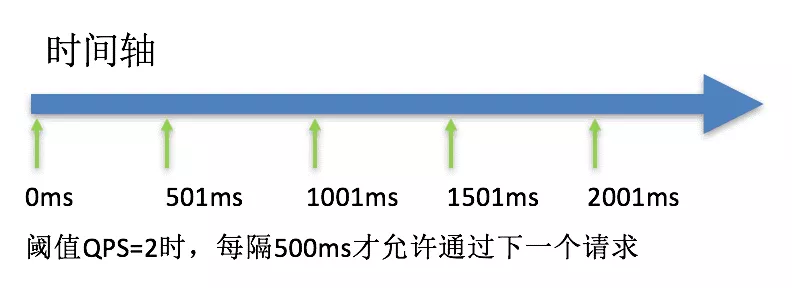

> 这种方式适合用于请求以突刺状来到，这个时候我们不希望一下子把所有的请求都通过，这样可能会把系统压垮；同时我们也期待系统以稳定的速度，逐步处理这些请求，以起到“**削峰填谷**”的效果，而不是拒绝所有请求。

比如设置QPS阈值为1，超时等待时间为10000毫秒，如下图：

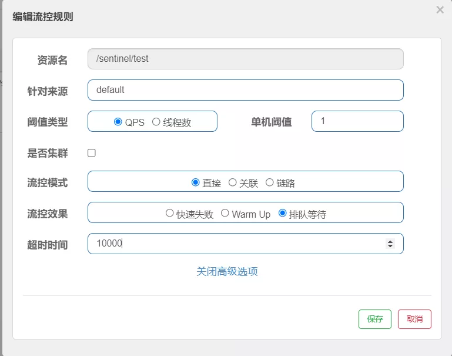

此时的效果如下：


从上图可以看到：连续点击刷新请求，虽然设置了QPS阈值为1，但是并没有被限流，而是在等待，因为设置了超时等待时间为10秒。

> 具体算法原理请看：https://github.com/alibaba/Sentinel/wiki/%E6%B5%81%E9%87%8F%E6%8E%A7%E5%88%B6-%E5%8C%80%E9%80%9F%E6%8E%92%E9%98%9F%E6%A8%A1%E5%BC%8F

### 2、三种流控模式

流控模式总共分为三种，对应元素`strategy`，分别如下：

- 直接拒绝：接口达到限流条件时，直接限流
- 关联：当关联的资源达到阈值时，就限流自己
- 链路：只记录指定链路上的流量（指定资源从入口资源进来的流量，如果达到阈值，就可以限流）

下面来详细介绍下以上三种流控模式。

#### 直接拒绝

顾名思义：默认的流量控制方式，当QPS超过任意规则的阈值后，新的请求就会被立即拒绝，拒绝方式为抛出`FlowException`。上面的几个例子都是配置了直接拒绝这个模式，这里不再详细介绍。

#### 关联

**典型的使用场景**：一个是**支付**接口，一个是**下单**接口，此时一旦**支付接口达到了阈值**，那么订单接口就应该被限流，不然这边还在下单，消费者等待或者直接被拒绝支付将会极大的影响用户体验。

> 简而言之：A关联B，一旦B达到阈值，则A被限流

演示一下效果，创建以下两个接口：

```java
@RestController
@RequestMapping("/sentinel")
public class FlowLimitController {

    /**
     * 下单接口
     * @return
     */
    @GetMapping("/order")
    public String order()  {
        return "下单成功..........";
    }

    /**
     * 支付接口
     * @return
     */
    @GetMapping("/pay")
    public String pay()  {
        return "支付成功..........";
    }
}
```

此时的流控规则配置如下图：

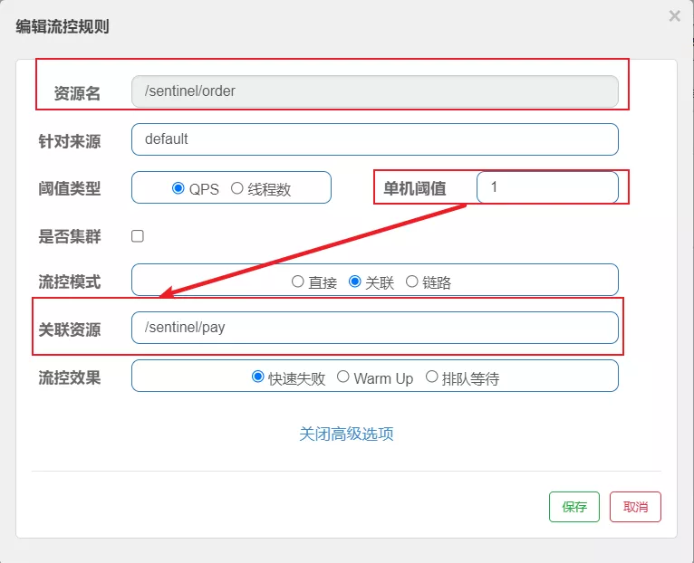

**注意**：关联之后，这里设置的限流规则是对被关联资源，也就是`/sentinel/pay`这个资源，但是真正被限流则是`/sentinel/order`。

如何演示效果呢？很简单，只需要不断的请求`/sentinel/pay`达到阈值，然后在请求`/sentinel/order`。

利用POSTMAN不断向`/sentinel/pay`发出请求，然后浏览器请求`/sentinel/order`，结果如下图：


可以看到订单接口被限流了.............

### 3、两种统计类型

流控分为两种统计类型，分别是**QPS**，**并发线程数**，很多人不太明白这两种统计类型有什么区别？

**举个栗子**：陈某带了一个亿去银行存钱，但是银行大门保安要查健康码，每秒最多只能同时进入4个人，并且银行中只有两个工作人员工作，如下图：

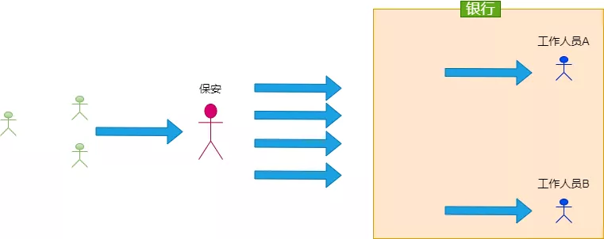

**此时的QPS含义**：从保安到银行这一段，即是保安放行进入银行的人数。

**此时并发线程数的含义**：银行只有两个工作人员在工作，那么最多只能同时处理两个任务，这里并发线程数的阈值就是2。

## 8、降级规则如何配置？

熔断降级在日常生活中也是比较常见的，场景如下：

- 股票市场的熔断，当价格触发到了熔点之后，会暂停交易一段时间，或者交易可以继续进行，但是报价会限制在一定的范围。
- 电压过高导致保险丝触发熔断保护

在大型的分布式系统中，一个请求的依赖如下图：


如果这个时候，某个服务出现一些异常，比如：

- 服务提供者不可用(硬件故障、程序bug、网络故障、用户请求量较大)
- 重试导致的流量过大
- 服务调用者使用同步调用，产生大量的等待线程占用系统资源，一旦线程资源被耗尽，调用者提供的服务也会变成不可用状态

那么将会导致整个服务不可用，用古话来讲就是：**千里之堤毁于蚁穴**。

所谓编程源于生活，架构师们根据生活的经验设计出了服务的熔断降级策略，很好的解决了这类问题。

熔断降级规则对应sentinel控制台的降级规则这一栏，如下图：

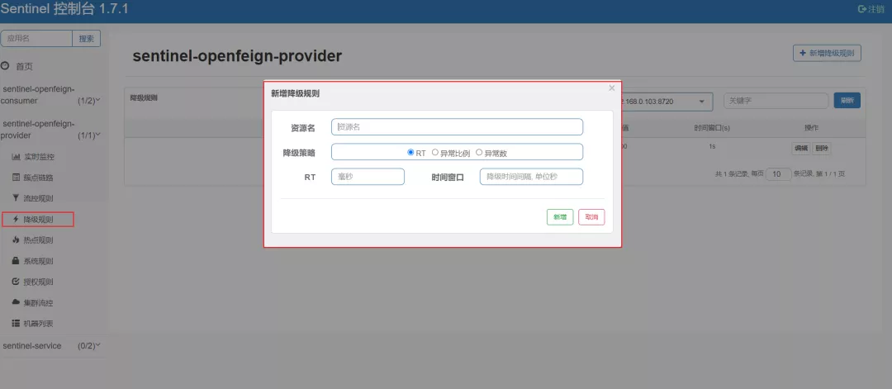

熔断降级涉及到的几个属性如下表：

|       Field        | 说明                                                         | 默认值     |
| :----------------: | :----------------------------------------------------------- | :--------- |
|      resource      | 资源名，即规则的作用对象                                     |            |
|       grade        | 熔断策略，支持慢调用比例/异常比例/异常数策略                 | 慢调用比例 |
|       count        | 慢调用比例模式下为慢调用临界 RT（超出该值计为慢调用）；异常比例/异常数模式下为对应的阈值 |            |
|     timeWindow     | 熔断时长，单位为 s                                           |            |
|  minRequestAmount  | 熔断触发的最小请求数，请求数小于该值时即使异常比率超出阈值也不会熔断（1.7.0 引入） | 5          |
|   statIntervalMs   | 统计时长（单位为 ms），如 60*1000 代表分钟级（1.8.0 引入）   | 1000 ms    |
| slowRatioThreshold | 慢调用比例阈值，仅慢调用比例模式有效（1.8.0 引入）           |            |

源码中对应得类为：`com.alibaba.csp.sentinel.slots.block.degrade.DegradeRule`。

#### 三种熔断策略

Sentinel 提供以下几种熔断策略：

1. **平均响应时间 (`DEGRADE_GRADE_RT`)**：当 1s 内持续进入 5 个请求，对应时刻的平均响应时间（秒级）均超过阈值（`count`，以 ms 为单位），那么在接下的时间窗口（`DegradeRule` 中的 `timeWindow`，以 s 为单位）之内，对这个方法的调用都会自动地熔断（抛出 `DegradeException`）。注意 Sentinel 默认统计的 RT 上限是 4900 ms，**超出此阈值的都会算作 4900 ms**，若需要变更此上限可以通过启动配置项 `-Dcsp.sentinel.statistic.max.rt=xxx` 来配置。
2. **异常比例 (`DEGRADE_GRADE_EXCEPTION_RATIO`)**：当资源的每秒请求量 >= 5，**并且**每秒异常总数占通过量的比值超过阈值（`DegradeRule` 中的 `count`）之后，资源进入降级状态，即在接下的时间窗口（`DegradeRule` 中的 `timeWindow`，以 s 为单位）之内，对这个方法的调用都会自动地返回。异常比率的阈值范围是 `[0.0, 1.0]`，代表 0% - 100%。
3. **异常数 (`DEGRADE_GRADE_EXCEPTION_COUNT`)**：当资源近 1 分钟的**异常数目**超过阈值之后会进行熔断。注意由于统计时间窗口是分钟级别的，若 `timeWindow` 小于 60s，则结束熔断状态后仍可能再进入熔断状态。

下面演示一个平均响应时间熔断，创建一个接口，如下：

```java
@RestController
@RequestMapping("/sentinel/provider")
@Slf4j
public class FlowLimitController {

    @GetMapping("/test")
    public String test() throws InterruptedException {
        //休眠3秒钟
        Thread.sleep(3000);
        log.info("收到一条消息----test");
        return "接收到一条消息--------";
    }
}
```

在控台为这个接口设置平均响应时间为200毫秒，时间窗口为1秒，**大致意思**：平均的响应时间大于200毫秒之后，在接下来的1秒时间内将会直接熔断，如下图：

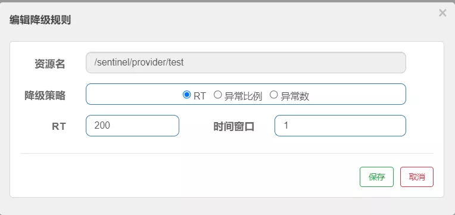

使用**Jmeter**开启10个线程循环跑，然后在浏览器中访问这个接口，返回结果如下图：


为什么呢？由于的接口中休眠了3秒，平均响应时间肯定大于200毫秒，因此直接被熔断了。

> **注意**：这里熔断后直接返回默认的信息，后面会介绍如何定制熔断返回信息。

## 9、热点参数如何限流？

顾名思义：热点就是经常访问的数据，很多时候肯定是希望统计某个访问频次`Top K`数据并对其进行限流。

比如秒杀系统中的**商品ID**，对于热点商品那一瞬间的并发量是非常可怕的，因此必须要对其进行限流。

Sentinel 利用 **LRU** 策略统计最近最常访问的热点参数，结合**令牌桶算法**来进行参数级别的流控。

**注意：热点参数限流只针对QPS。**

> 官方文档：https://github.com/alibaba/Sentinel/wiki/%E7%83%AD%E7%82%B9%E5%8F%82%E6%95%B0%E9%99%90%E6%B5%81

概念理解了，来看下sentinel控制台如何设置热点参数限流，如下图：


规则对应得源码在`com.alibaba.csp.sentinel.slots.block.flow.param.ParamFlowRule`这个类中，各种属性含义如下图：

|       属性        | 说明                                                         | 默认值   |
| :---------------: | :----------------------------------------------------------- | :------- |
|     resource      | 资源名，必填                                                 |          |
|       count       | 限流阈值，必填                                               |          |
|       grade       | 限流模式                                                     | QPS 模式 |
|   durationInSec   | 统计窗口时间长度（单位为秒），1.6.0 版本开始支持             | 1s       |
|  controlBehavior  | 流控效果（支持快速失败和匀速排队模式），1.6.0 版本开始支持   | 快速失败 |
| maxQueueingTimeMs | 最大排队等待时长（仅在匀速排队模式生效），1.6.0 版本开始支持 | 0ms      |
|     paramIdx      | 热点参数的索引，必填，对应 `SphU.entry(xxx, args)` 中的参数索引位置 |          |
| paramFlowItemList | 参数例外项，可以针对指定的参数值单独设置限流阈值，不受前面 `count` 阈值的限制。**仅支持基本类型和字符串类型** |          |
|    clusterMode    | 是否是集群参数流控规则                                       | `false`  |
|   clusterConfig   | 集群流控相关配置                                             |          |

规则都懂了，下面我们通过实战来演示一下热点参数到底是如何限流的。

**注意**：热点参数限流只作用于八大基本类型。

### 1、创建一个资源

现在先创建一个service，用`@SentinelResource`这个注解定义一个资源，这个注解后续将会详细介绍，先忽略，代码如下：

```java
@Service
@Slf4j
public class FlowServiceImpl implements FlowService {

    /**
     * @SentinelResource的value属性指定了资源名，一定要唯一
     * blockHandler属性指定了兜底方法
     */
    @Override
    @SentinelResource(value = "OrderQuery",blockHandler = "handlerQuery")
    public String query(String p1, String p2) {
        log.info("查询商品，p1：{}，p2：{}",p1,p2);
        return "查询商品：success";
    }

    /**
     * 对应得兜底方法，一旦被限流将会调用这个方法来处理
     */
    public String handlerQuery(@RequestParam(value = "p1",required = false) String p1,
                               @RequestParam(value = "p2",required = false)String p2,
                               BlockException exception){
        log.info("查询商品，p1：{}，p2：{}",p1,p2);
        return "查询商品：熔断了......";
    }
}
```

上述代码什么意思呢？如下：

- 如果query这个接口没有被限流则返回：查询商品：success
- 如果query这个接口被限流了，则进入了兜底方法`handlerQuery`方法，返回：查询商品：熔断了......

### 2、创建controller接口

下面创建一个controller进行测试，代码如下：

```java
@RestController
@RequestMapping("/sentinel/provider")
@Slf4j
public class FlowLimitController {
    @Autowired
    private FlowService flowService;

    @GetMapping("/order/query")
    public String query(@RequestParam(value = "p1",required = false) String p1, @RequestParam(value = "p2",required = false)String p2){
        return flowService.query(p1,p2);
    }

}
```

可以看到接口中有两个参数，分别是`p1`、`p2`。

### 3、添加热点参数限流规则

在sentinel控制台点击`热点规则->新增热点限流规则`，添加如下图规则：


上述配置的具体含义：当`OrderQuery`这个资源中的**第0个参数**QPS超过**1秒1次**将会被限流。这里参数索引是从0开始，第0个就是对应接口中的`p1`这个参数。

**第一个测试**：浏览器直接访问：http://localhost:9009/sentinel/provider/order/query?p1=22&p2=1222，连续点击将会看到这个接口被熔断降级了，如下图：


这也正是验证了上述的热点参数限流配置。

**第二个测试**：浏览器输入：http://localhost:9009/sentinel/provider/order/query?p2=1222，连续点击将会看到这个接口并没有被熔断降级，如下图：


> **注意**：对于热点参数限流，只有包含指定索引的参数请求才会被限流，否则不影响。

此时产品说：ID为100的这个产品点击量太少了，你们赶紧调整下这个商品的限流规则。这个时候该怎么办呢？

别着急，sentinel显然考虑到了这一点，提供了**参数例外项**这项配置，针对产品需求配置如下：


从上图配置中，我们将参数值**p1**这个参数值等于100的时候，限流阈值设置成了100，也就是说`p1=100`这个请求QPS放宽到1秒请求100次以上才会被限流。

**验证**：浏览器输入地址：http://localhost:9009/sentinel/provider/order/query?p1=100，无论点击多么快，都没有被熔断降级，显然是配置生效了，如下图：


> 以上源码在sentinel-openfeign-provider9009这个模块中，文末有源码获取方式。

## 10、系统自适应如何限流？

前面热点参数、普通流量限流都是针对的某个接口，这里系统自适应限流针对是整个系统的入口流量，从单台机器的 **load**、**CPU 使用率**、**平均 RT**、**入口 QPS** 和**并发线程数**等几个维度监控应用指标，让系统尽可能跑在最大吞吐量的同时保证系统整体的稳定性。

sentinel控制台对应如下图：


阈值类型有五种，分别如下：

- **Load 自适应**（仅对 Linux/Unix-like 机器生效）：系统的 load1 作为启发指标，进行自适应系统保护。当系统 load1 超过设定的启发值，且系统当前的并发线程数超过估算的系统容量时才会触发系统保护（BBR 阶段）。系统容量由系统的 `maxQps * minRt` 估算得出。设定参考值一般是 `CPU cores * 2.5`。
- **CPU usage**（1.5.0+ 版本）：当系统 CPU 使用率超过阈值即触发系统保护（取值范围 0.0-1.0），比较灵敏。
- **平均 RT**：当单台机器上所有入口流量的平均 RT 达到阈值即触发系统保护，单位是毫秒。
- **并发线程数**：当单台机器上所有入口流量的并发线程数达到阈值即触发系统保护。
- **入口 QPS**：当单台机器上所有入口流量的 QPS 达到阈值即触发系统保护。

> 官方文档：https://github.com/alibaba/Sentinel/wiki/%E7%B3%BB%E7%BB%9F%E8%87%AA%E9%80%82%E5%BA%94%E9%99%90%E6%B5%81

系统规则的配置比较简单，这里以入口QPS为例进行演示，为了演示真实情况，清掉所有的限流规则，添加系统规则，如下图：

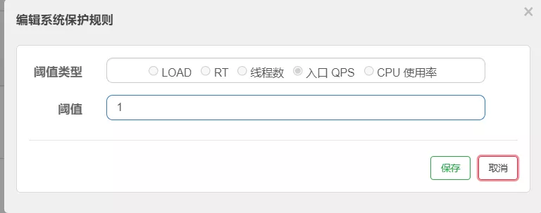

这个QPS系统规则一配置，该微服务中的所有接口都将会被这个规则限制，比如访问：http://localhost:9009/sentinel/provider/pay，连续点击，如下图：


可以看到已经被限流了，不仅是这个接口，所有接口都会生效。

**注意**：系统规则中的入口QPS这个规则不建议配置，一旦配置上了可能导致整个服务不可用。

## 11、如何自定义限流返回的异常信息？

在前面的例子中，无论是熔断降级还是被限流返回的异常信息都是`Blocked by Sentinel (flow limiting)`，这个是Sentinel默认的异常信息。

很显然默认的异常信息并不能满足我们的业务需求，因此我们需要根据前后端规则制定自己的异常返回信息。

这里将会用到一个注解`@SentinelResource`，这个在上文也是提到过，这个注解中有两个关于限流兜底方法的属性，如下：

- **blockHandler**： 对应处理 `BlockException` 的函数名称。blockHandler 函数访问范围需要是 `public`，返回类型需要与原方法相匹配，参数类型需要和原方法相匹配并且最后加一个额外的参数，类型为 `BlockException`。blockHandler 函数默认需要和原方法在同一个类中。
- **blockHandlerClass**：指定 `blockHandlerClass` 为对应的类的 `Class` 对象，注意对应的函数必需为 `static` 函数，否则无法解析。

> 官方文档：https://github.com/alibaba/Sentinel/wiki/%E6%B3%A8%E8%A7%A3%E6%94%AF%E6%8C%81

使用`@SentinelResource`注解自定义一个限流异常返回信息，先自定义一个资源，指定兜底方法为`handler`，代码如下：

```java
/**
* 使用@SentinelResource定义一个资源，限流兜底方法为handler
* @param id
* @return
*/
@Override
@SentinelResource(value = "QueryOrder",blockHandlerClass = CommonHandler.class,blockHandler = "handler")
public CommonResponse<Order> queryOrder(Long id) {
  return CommonResponse.<Order>builder()
    .code("200")
    .message("请求成功")
    .data(Order.builder()
          .id(id)
          .money(200)
          .name("码猿技术专栏")
          .num("100")
          .build())
    .build();
}
```

第二步：写个对应得兜底方法，必须在同一个类中，代码如下：

```java
/**
* 这个QueryOrder资源的兜底方法
*/
public CommonResponse<Order> handler(Long id, BlockException exception) {
  log.error("哎，又被限流了，异常消息：{}", JSON.toJSONString(exception));
  return CommonResponse.<Order>builder()
    .code("1001")
    .message("限流异常了o(╥﹏╥)o")
    .build();
}
```

第三步：对资源`QueryOrder`新增一个限流规则，如下图：


第四步：写个controller，代码就不晒了，自己写吧，哈哈。。。。

第五步：调用接口，疯狂点击，将会出现兜底方法中定义的返回信息，如下图：


到这儿基本算是成功了，但是有个问题：**兜底方法必须要和业务方法放在同一个类中，这样代码耦合度不是很高吗？**

`@SentinelResource`提供一个属性`blockHandlerClass`，完美的解决了这一个问题，能够将兜底方法单独放在一个类中，下面来介绍一下。

**第一步**：新建一个单独的类`CommonHandler`来放置兜底方法，代码如下：

```java
/**
 * 公共的兜底类
 */
@SuppressWarnings("rawtypes")
@Slf4j
public class CommonHandler {

  /**
  * 兜底方法，必须是public，必须是static方法，返回类型必须和原业务方法相同
  */
  public static CommonResponse<Order> handler(Long id, BlockException exception){
    log.error("哎，又被限流了，异常消息：{}", JSON.toJSONString(exception));
    return CommonResponse.<Order>builder()
      .code("1001")
      .message("限流异常了o(╥﹏╥)o")
      .build();
  }
}
```

**第二步**：在`@SentinelResource`注解中指定blockHandlerClass为上面的类，blockHandler指定兜底方法名，代码如下：

```java
/**
* 使用@SentinelResource定义一个资源，限流兜底方法为handler
* @param id
* @return
*/
@Override
@SentinelResource(value = "QueryOrder",blockHandlerClass = CommonHandler.class,blockHandler = "handler")
public CommonResponse<Order> queryOrder(Long id) {
  return CommonResponse.<Order>builder()
    .code("200")
    .message("请求成功")
    .data(Order.builder()
          .id(id)
          .money(200)
          .name("码猿技术专栏")
          .num("100")
          .build())
    .build();
}
```

好了，至此就完成了，自己照着试试吧.......

> 上述源码在sentinel-openfeign-provider9009这个模块中，源码获取方式见文末。

## 12、如何对异常进行降级处理？

程序员每天都在制造BUG，没有完美的代码，也没有完美的程序员，针对代码的运行时异常我们无法避免，但是我们可以当出现异常的时候进行捕获并做出相应的处理，我们称之为降级处理。

异常的降级还是要用到`@SentinelResource`注解，其中相关的几个属性如下：

- **fallback**：fallback 函数名称，可选项，用于在抛出异常的时候提供 fallback 处理逻辑。fallback 函数可以针对所有类型的异常（除了 `exceptionsToIgnore` 里面排除掉的异常类型）进行处理。fallback 函数签名和位置要求：

- - 返回值类型必须与原函数返回值类型一致；
  - 方法参数列表需要和原函数一致，或者可以额外多一个 `Throwable` 类型的参数用于接收对应的异常。
  - fallback 函数默认需要和原方法在同一个类中。若希望使用其他类的函数，则可以指定 `fallbackClass` 为对应的类的 `Class` 对象

- **fallbackClass**：指定对应的类的 `Class` 对象，注意对应的函数必需为 static 函数，否则无法解析。

- **defaultFallback**（since 1.6.0）：默认的 fallback 函数名称，可选项，通常用于通用的 fallback 逻辑（即可以用于很多服务或方法）。默认 fallback 函数可以针对所有类型的异常（除了 `exceptionsToIgnore` 里面排除掉的异常类型）进行处理。**若同时配置了 fallback 和 defaultFallback，则只有 fallback 会生效**。defaultFallback 函数签名要求：

- - 返回值类型必须与原函数返回值类型一致；
  - **方法参数列表需要为空**，或者可以额外多一个 `Throwable` 类型的参数用于接收对应的异常。
  - defaultFallback 函数默认需要和原方法在同一个类中。若希望使用其他类的函数，则可以指定 `fallbackClass` 为对应的类的 `Class` 对象，注意对应的函数必需为 static 函数，否则无法解析。

- **exceptionsToIgnore**（since 1.6.0）：用于指定哪些异常被排除掉，不会计入异常统计中，也不会进入 fallback 逻辑中，而是会原样抛出。

1.8.0 版本开始，`defaultFallback` 支持在类级别进行配置。

> 注：1.6.0 之前的版本 fallback 函数只针对降级异常（`DegradeException`）进行处理，**不能针对业务异常进行处理**。

> 官方文档：https://github.com/alibaba/Sentinel/wiki/%E6%B3%A8%E8%A7%A3%E6%94%AF%E6%8C%81

下面定义一个创建订单的接口，手动制造一个`1/0`异常，代码如下：

```java
@Override
@SentinelResource(value = "createOrder")
public CommonResponse createOrder(Order order) {
  log.debug("订单创建成功：{}", JSON.toJSONString(order));
  System.out.println(1/0);
  return CommonResponse.builder()
    .code("200")
    .message("订单创建成功")
    .build();
}
```

上述接口并没有进行异常降级处理，因此调用该接口直接返回了异常信息，非常不友好，如下图：

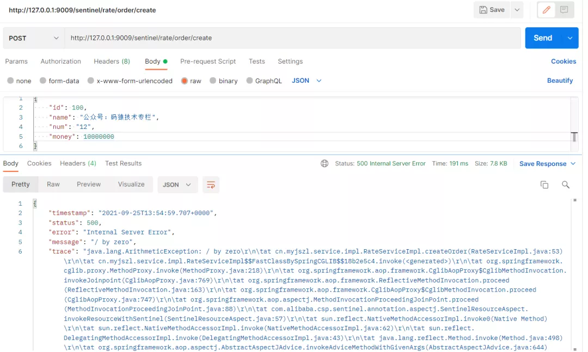

我们可以使用`fallback`指定异常降级的兜底方法，此时业务方法改造如下：

```java
/**
* 创建订单，fallbackClass指定异常降级兜底的类，fallback指定兜底方法
*/
@Override
@SentinelResource(value = "createOrder",
                  fallbackClass = FallbackHandler.class,fallback = "fallbackHandler")
public CommonResponse createOrder(Order order) {
  log.debug("订单创建成功：{}", JSON.toJSONString(order));
  System.out.println(1/0);
  return CommonResponse.builder()
    .code("200")
    .message("订单创建成功")
    .build();
}
```

使用`fallbackClass`属性指定单独一个类处理异常降级，降低了代码的耦合度，`fallback`属性指定了降级兜底的方法，代码如下：

```java
/**
* 异常降级的兜底方法，参数签名必须和原业务方法一致，可以多个Throwable
*/
public static CommonResponse fallbackHandler(Order order, Throwable ex){
  log.error("进入了指定降级兜底方法，业务处理出现了运行时异常：{}",ex.getMessage());
  return CommonResponse.<Order>builder()
    .code("1001")
    .message("创建订单失败，出现异常了.......")
    .build();
}
```

此时再次访问接口，虽然有异常，但是返回的确实降级兜底方法中的返回信息，如下图：


```java
/**
* 创建订单，fallbackClass指定异常降级兜底的类，fallback指定兜底方法
*/
@Override
@SentinelResource(value = "createOrder",
                  blockHandlerClass = CommonHandler.class,blockHandler = "handlerOrder",
                  fallbackClass = FallbackHandler.class,fallback = "fallbackHandler")
public CommonResponse createOrder(Order order) {
  log.debug("订单创建成功：{}", JSON.toJSONString(order));
  System.out.println(1/0);
  return CommonResponse.builder()
    .code("200")
    .message("订单创建成功")
    .build();
}
```

到了这里基本满足了异常降级的处理需求，但是仍然有个疑问：**能否只用一个方法处理全部的异常？**

答案是：**能**，**必须能**，此时就要用到`defaultFallback`这个属性了，指定默认的降级兜底方法，此时的业务方法变成如下代码：

```java
/**
* 创建订单，fallbackClass指定异常降级兜底的类，defaultFallback指定默认的兜底方法
*/
@Override
@SentinelResource(value = "createOrder2",fallbackClass = FallbackHandler.class,defaultFallback = "defaultFallbackHandler")
public CommonResponse createOrder2(Order order) {
  log.debug("订单创建成功：{}", JSON.toJSONString(order));
  System.out.println(1/0);
  return CommonResponse.builder()
    .code("200")
    .message("订单创建成功")
    .build();
}
```

`defaultFallback`属性指定了默认的降级兜底方法，这个方法代码如下：

```java
/**
* 默认的异常降级处理方法，适用于所有服务，参数签名必须为空，可以多个Throwable
*/
public static CommonResponse defaultFallbackHandler(Throwable ex){
  log.error("进入了默认异常降级兜底方法，业务处理出现了运行时异常：{}",ex.getMessage());
  return CommonResponse.<Order>builder()
    .code("1001")
    .message("创建订单失败，出现异常了.......")
    .build();
}
```

好了，异常降级处理到这儿已经介绍完了，但是仍然有一个问题：**若 blockHandler 和 fallback 都进行了配置，那么哪个会生效？**

> **结论**：若 blockHandler 和 fallback 都进行了配置，则被限流降级而抛出 `BlockException` 时只会进入 `blockHandler` 处理逻辑。若未配置 `blockHandler`、`fallback` 和 `defaultFallback`，则被限流降级时会将 `BlockException` **直接抛出**。

将`createOrder`这个业务接口改造一下，同时指定blockHandler和fallback，代码如下：

```java
/**
* 创建订单，fallbackClass指定异常降级兜底的类，fallback指定兜底方法
*/
@Override
@SentinelResource(value = "createOrder",
                  blockHandlerClass = CommonHandler.class,blockHandler = "handlerOrder",
                  fallbackClass = FallbackHandler.class,fallback = "fallbackHandler")
public CommonResponse createOrder(Order order) {
  log.debug("订单创建成功：{}", JSON.toJSONString(order));
  System.out.println(1/0);
  return CommonResponse.builder()
    .code("200")
    .message("订单创建成功")
    .build();
}
```

此时不配置任何规则，直接访问接口，可以看到这里直接进入了异常降级处理，如下图：


我们对`createOrder`这个资源配置降级规则：60秒内如果出现2个以上的异常直接限流，如下图：


此时我们再次访问这个接口，可以看到前两次直接进入了`fallback`指定的方法中（并未达到限流的异常数阈值），两次之后就被限流了，进入了`blockHandler`方法中，效果如下图：

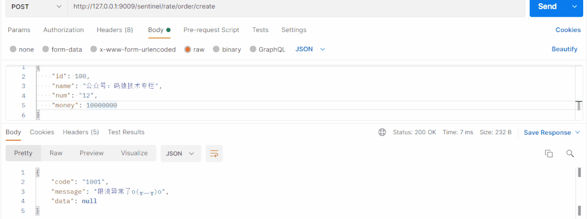

> 上述源码在sentinel-openfeign-provider9009这个模块中，源码获取方式见文末。

## 13、sentinel的黑白名单如何设置？

顾名思义，黑名单就是拉黑呗，拉黑就是不能访问了呗，sentinel能够针对请求来源进行是否放行，若配置白名单则只有请求来源位于白名单内时才可通过；若配置黑名单则请求来源位于黑名单时不通过，其余的请求通过。

sentinel控制台对应得规则配置如下图：


该规则对应得源码为`com.alibaba.csp.sentinel.slots.block.authority.AuthorityRule`，几个属性如下：

- `resource`：资源名，即限流规则的作用对象。
- `limitApp`：对应的黑名单/白名单，不同 origin 用 `,` 分隔，如 `appA,appB`。
- `strategy`：限制模式，`AUTHORITY_WHITE` 为白名单模式，`AUTHORITY_BLACK` 为黑名单模式，默认为白名单模式。

> 官方文档：https://github.com/alibaba/Sentinel/wiki/%E9%BB%91%E7%99%BD%E5%90%8D%E5%8D%95%E6%8E%A7%E5%88%B6

这里有个问题：**请求来源是什么，怎么获取？**

Sentinel提供了一个接口`RequestOriginParser`，我们可以实现这个接口根据自己业务的规则解析出请求来源名称。

下面我以**IP**作为区分请求来源，代码如下：

```java
/**
 * 请求来源解析类
 */
@Component
public class RequestOrigin implements RequestOriginParser {
    /**
     * 解析请求来源
     * @param httpServletRequest 该参数能够获取请求的一切信息，方便开发者解析
     * @return 返回的就是请求来源名称
     */
    @Override
    public String parseOrigin(HttpServletRequest httpServletRequest) {
        return httpServletRequest.getRemoteAddr();
    }
}
```

然后将`127.0.0.1`设置为黑名单，如下图：


直接访问：http://127.0.0.1:9009/sentinel/rate/order/query?id=1002，结果如下图：


可以看到被限流了哦.................

好了，黑白名单就介绍到这里。

> 上述源码在sentinel-openfeign-provider9009这个模块中，源码获取方式见文末。

## 14、限流规则如何持久化？

Sentinel默认限流规则是存储在**内存**中，只要服务重启之后对应得限流规则也会消失，实际的生产中肯定是不允许这种操作，因此限流规则的持久化迫在眉睫。

sentinel官方文档提供了3种持久化模式，分别如下：

| 推送模式                                                     | 说明                                                         | 优点                         | 缺点                                                         |
| ------------------------------------------------------------ | ------------------------------------------------------------ | ---------------------------- | ------------------------------------------------------------ |
| [原始模式](https://github.com/alibaba/Sentinel/wiki/在生产环境中使用-Sentinel#原始模式) | API 将规则推送至客户端并直接更新到内存中，扩展写数据源（[`WritableDataSource`](https://github.com/alibaba/Sentinel/wiki/动态规则扩展)） | 简单，无任何依赖             | 不保证一致性；规则保存在内存中，重启即消失。严重不建议用于生产环境 |
| [Pull 模式](https://github.com/alibaba/Sentinel/wiki/在生产环境中使用-Sentinel#Pull模式) | 扩展写数据源（[`WritableDataSource`](https://github.com/alibaba/Sentinel/wiki/动态规则扩展)）， 客户端主动向某个规则管理中心定期轮询拉取规则，这个规则中心可以是 RDBMS、文件 等 | 简单，无任何依赖；规则持久化 | 不保证一致性；实时性不保证，拉取过于频繁也可能会有性能问题。 |
| **[Push 模式](https://github.com/alibaba/Sentinel/wiki/在生产环境中使用-Sentinel#Push模式)** | 扩展读数据源（[`ReadableDataSource`](https://github.com/alibaba/Sentinel/wiki/动态规则扩展)），规则中心统一推送，客户端通过注册监听器的方式时刻监听变化，比如使用 Nacos、Zookeeper 等配置中心。这种方式有更好的实时性和一致性保证。**生产环境下一般采用 push 模式的数据源。** | 规则持久化；一致性；快速     | 引入第三方依赖                                               |

但是官方推荐使用`Push`模式，下面陈某就Push模式介绍一下持久化限流规则。这里使用Nacos作为配置中心。

盗用官方一张架构图，如下：


### 1、添加依赖

这里需要添加一个依赖，如下：

```xml
<dependency>
      <groupId>com.alibaba.csp</groupId>
      <artifactId>sentinel-datasource-nacos</artifactId>
</dependency>
```

### 2、配置文件中配置相关信息

既然使用到了Nacos作为配置中心，肯定是要配置相关的地址、dataId...

在`application.yml`配置文件中添加如下配置：

```yaml
spring:
  cloud:
    sentinel:
      ## nacos持久化配置
      datasource:
        ## 配置流控规则，名字任意
        ds-flow:
          nacos:
            ## nacos的地址
            server-addr: 127.0.0.1:8848
            ## 配置ID
            dataId: ${spring.application.name}-flow
            ## 配置分组，默认是DEFAULT_GROUP
            groupId: DEFAULT_GROUP
            ## 配置存储的格式
            data-type: json
            ## rule-type设置对应得规则类型，总共七大类型，在com.alibaba.cloud.sentinel.datasource.RuleType这个枚举类中有体现
            rule-type: flow
        ## 配置降级规则，名字任意
        ds-degrade:
          nacos:
            ## nacos的地址
            server-addr: 127.0.0.1:8848
            ## 配置ID
            dataId: ${spring.application.name}-degrade
            ## 配置分组，默认是DEFAULT_GROUP
            groupId: DEFAULT_GROUP
            ## 配置存储的格式
            data-type: json
            ## rule-type设置对应得规则类型，总共七大类型，在com.alibaba.cloud.sentinel.datasource.RuleType这个枚举类中有体现
            rule-type: degrade
```

上述配置仅仅展示了和持久化相关的一些配置，其他相关的配置代码就不贴了，稍后自己看源码。

`spring.cloud.sentinel.datasource`下可以配置多个规则，陈某这里只配置了限流和降级规则，其他规则自己尝试配一下，不同规则通过`rule-type`区分，其取值都在`com.alibaba.cloud.sentinel.datasource.RuleType`这个枚举类中，对应着sentinel中的几大统计规则。

### 3、在Nacos添加对应的规则配置

上述配置中对应的限流（flow）规则如下图：

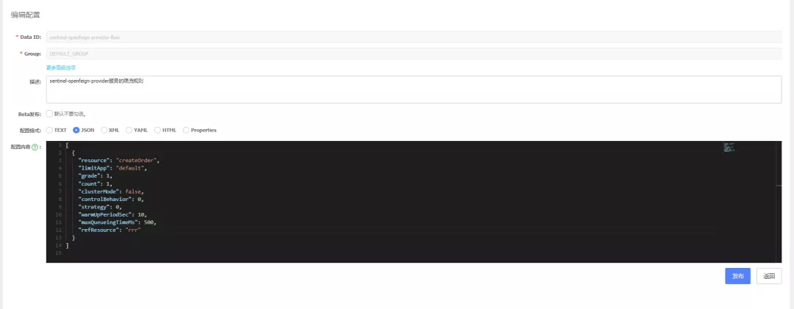

上述配置中对应的降级（degrade）规则如下图：


先不纠结JSON数据里面到底是什么，先看效果，全部发布之后，Nacos中总共有了两个配置，如下图：


上图中可以看到我们的两种规则已经在Nacos配置好了，来看一下sentinel中是否已经生效了，如下图：


哦了，已经生效了，由于是push模式，只要nacos中点击发布配置，相关规则配置就会推送到sentinel中。

> 上述源码在sentinel-openfeign-provider9009这个模块中，源码获取方式见文末。

**伏笔**：push模式只能保证Nacos中的修改推送到sentinel控制台，**但是sentinel控制台的限流规则修改如何推送到Nacos呢？**别着急，下面将会介绍..............

### 4、JSON中到底怎么写？

很多人好奇JOSN中的配置到底怎么写？其实很简单，陈某在介绍各种规则的时候都明确告诉你每种规则对应源码中的实现类，比如流控规则对应的类就是`com.alibaba.csp.sentinel.slots.block.flow.FlowRule`，JOSN中各个属性也是来源于这个类。

下面陈某列出各个规则的JSON配置，开发中照着改即可。

**1、流控规则**

```json
[
  {
    // 资源名
    "resource": "/test",
    // 针对来源，若为 default 则不区分调用来源
    "limitApp": "default",
    // 限流阈值类型(1:QPS;0:并发线程数）
    "grade": 1,
    // 阈值
    "count": 1,
    // 是否是集群模式
    "clusterMode": false,
    // 流控效果(0:快速失败;1:Warm Up(预热模式);2:排队等待)
    "controlBehavior": 0,
    // 流控模式(0:直接；1:关联;2:链路)
    "strategy": 0,
    // 预热时间（秒，预热模式需要此参数）
    "warmUpPeriodSec": 10,
    // 超时时间（排队等待模式需要此参数）
    "maxQueueingTimeMs": 500,
    // 关联资源、入口资源(关联、链路模式)
    "refResource": "rrr"
  }
]
```

**2、降级规则**

```json
[
  {
   // 资源名
    "resource": "/test1",
    "limitApp": "default",
    // 熔断策略（0:慢调用比例，1:异常比率，2:异常计数）
    "grade": 0,
    // 最大RT、比例阈值、异常数
    "count": 200,
    // 慢调用比例阈值，仅慢调用比例模式有效（1.8.0 引入）
    "slowRatioThreshold": 0.2,
    // 最小请求数
    "minRequestAmount": 5,
    // 当单位统计时长(类中默认1000)
    "statIntervalMs": 1000,
    // 熔断时长
    "timeWindow": 10
  }
]
```

**3、热点规则**

```json
[
  {
   // 资源名
    "resource": "/test1",
    // 限流模式（QPS 模式，不可更改）
    "grade": 1,
    // 参数索引
    "paramIdx": 0,
    // 单机阈值
    "count": 13,
    // 统计窗口时长
    "durationInSec": 6,
    // 是否集群 默认false
    "clusterMode": 默认false,
    // 
    "burstCount": 0,
    // 集群模式配置
    "clusterConfig": {
      // 
      "fallbackToLocalWhenFail": true,
      // 
      "flowId": 2,
      // 
      "sampleCount": 10,
      // 
      "thresholdType": 0,
      // 
      "windowIntervalMs": 1000
    },
    // 流控效果（支持快速失败和匀速排队模式）
    "controlBehavior": 0,
    // 
    "limitApp": "default",
    // 
    "maxQueueingTimeMs": 0,
    // 高级选项
    "paramFlowItemList": [
      {
       // 参数类型
        "classType": "int",
       // 限流阈值
        "count": 222,
       // 参数值
        "object": "2"
      }
    ]
  }
]
```

**4、系统规则**

负值表示没有阈值检查。`不需要删除参数`

```json
[
  {
   // RT
    "avgRt": 1,
    // CPU 使用率
    "highestCpuUsage": -1,
    // LOAD
    "highestSystemLoad": -1,
    // 线程数
    "maxThread": -1,
    // 入口 QPS
    "qps": -1
  }
]
```

**5、授权规则**

```js
[
  {
    // 资源名
    "resource": "sentinel_spring_web_context",
   // 流控应用
    "limitApp": "/test",
    // 授权类型(0代表白名单；1代表黑名单。)
    "strategy": 0
  }
]
```

**注意**：对于上述JOSN中的一些可选属性不需要的时候可以删除。

> 官方文档：https://github.com/alibaba/Sentinel/wiki/%E5%9C%A8%E7%94%9F%E4%BA%A7%E7%8E%AF%E5%A2%83%E4%B8%AD%E4%BD%BF%E7%94%A8-Sentinel

## 15、限流规则如何推送到Nacos进行持久化？

sentinel默认的持久化只能从nacos推送到sentinel控制台，但是实际生产中肯定是双向修改都能推送的，这个如何解决呢？

其实sentinel官方文档就有说到解决方法，不过需要**自己修改sentinel控制台的源码**来实现。

这个还是比较复杂的，sentinel只帮我们实现了流控规则的demo，其他的还是要自己修改，这点不太人性化....

在这之前需要自己下载对应版本的sentinel控制台的源码，地址：https://github.com/alibaba/Sentinel/tags

### 流控规则源码修改

在源码的test目录下有sentinel提供的demo，分别有apollo、nacos、zookeeper，如下图：


这里我们是Nacos，因此只需要nacos包下面的demo。修改步骤如下：

**1、去掉sentinel-datasource-nacos依赖的scop**

这个sentinel-datasource-nacos依赖默认是`<scope>test</scope>`，因此我们需要去掉这个，如下：

```xml
<!-- for Nacos rule publisher sample -->
<dependency>
       <groupId>com.alibaba.csp</groupId>
       <artifactId>sentinel-datasource-nacos</artifactId>
</dependency>
```

> 如果你集成的zookeeper或者apollo，则把相应的依赖也要修改。

**2、复制test环境下的nacos整个包到main下**

将这个nacos包复制到`com.alibaba.csp.sentinel.dashboard.rule`这个包下，如下图：


**3、将FlowControllerV2中的代码复制到FlowControllerV1中**

`com.alibaba.csp.sentinel.dashboard.controller.v2.FlowControllerV2`这个是sentinel提供的demo，只需要将其中的代码全部覆盖到`com.alibaba.csp.sentinel.dashboard.controller.FlowControllerV1`中。

**4、修改FlowControllerV1中的代码**

直接覆盖掉当然不行，还要做一些修改，如下：

- 修改RequestMapping中的请求url为`/v1/flow`
- 修改`ruleProvider`、`rulePublisher`的依赖，修改后的代码如下：

```java
 		@Autowired
    //使用nacos的依赖
    @Qualifier("flowRuleNacosProvider")
    private DynamicRuleProvider<List<FlowRuleEntity>> ruleProvider;
    @Autowired
    //使用nacos的依赖
    @Qualifier("flowRuleNacosPublisher")
    private DynamicRulePublisher<List<FlowRuleEntity>> rulePublisher;
```

**5、注意nacos的相关配置**

`com.alibaba.csp.sentinel.dashboard.rule.nacos.NacosConfigUtil`这个工具类中对应的是限流规则在nacos中的一些配置项，有`groupId`、`dataId`...对应的配置如下：


**需要两边统一，可以自己修改。**

`com.alibaba.csp.sentinel.dashboard.rule.nacos.NacosConfig`这个类中有个方法如下图：


**默认指定的nacos地址是本地的，这个需要修改。**

**6、完成**

以上步骤已经改造了sentinel控制台的流控规则，打包启动控制台代码，命令如下：

```bash
mvn clean install -DskipTests=true -pl sentinel-dashboard -am
```

启动后在控制台添加流控规则，可以看到也会同步推送到nacos，包括增删改。

> 其他规则修改也很简单，照葫芦画瓢，这里就不再详细说了，后面会单独出一篇文章详细说一下。

## 16、集群流控如何做？

首先一个简单的问题：为什么需要集群流控？单机流控不香吗？原因如下：

- 对于微服务要想保证高可用，必须是集群，假设有100个集群，那么想要设置流控规则，是不是每个微服务都要设置一遍？维护成本太高了
- 单体流控还会造成**流量不均匀**的问题，出现总流控阈值没有达到某些微服务已经被限流了，这个是非常糟糕的问题，因此实际生产中对于集群不推荐单体流控。

那么如何解决上述的问题呢？sentinel为我们提供了集群流控的规则。思想很简单就是提供一个专门的server来统计调用的总量，其他的实例都与server保持通信。

集群流控可以精确地控制整个集群的**调用总量**，结合**单机限流兜底**，可以更好地发挥流量控制的效果。

集群流控中共有两种身份：

- **Token Client**：集群流控客户端，用于向所属 Token Server 通信请求 token。集群限流服务端会返回给客户端结果，决定是否限流。
- **Token Server**：即集群流控服务端，处理来自 Token Client 的请求，根据配置的集群规则判断是否应该发放 token（是否允许通过）。

sentinel的集群限流有两种模式，分别如下：

- **独立模式（Alone）**：即作为独立的 token server 进程启动，独立部署，隔离性好，但是需要额外的部署操作。独立模式适合作为 Global Rate Limiter 给集群提供流控服务。
- **嵌入模式（Embedded）**：即作为内置的 token server 与服务在同一进程中启动。在此模式下，集群中各个实例都是对等的，token server 和 client 可以随时进行转变，因此无需单独部署，灵活性比较好。但是隔离性不佳，需要限制 token server 的总 QPS，防止影响应用本身。嵌入模式适合某个应用集群内部的流控。

下面就以嵌入模式为例介绍一下如何配置。

就以`sentinel-openfeign-provider9009`这个模块作为演示，直接启动三个集群，端口分别为`9009`、`9011`、`9013`，如下图：


启动成功，在sentinel控制台将会看到有三个实例已经被监控了，如下图：

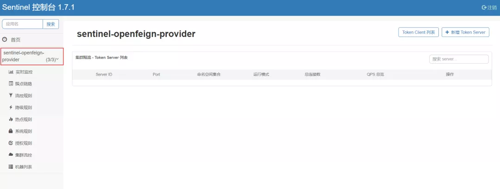

此时只需要在控制台指定一个服务为token server，其他的为token client，**集群流控->新增token server**，操作如下图：

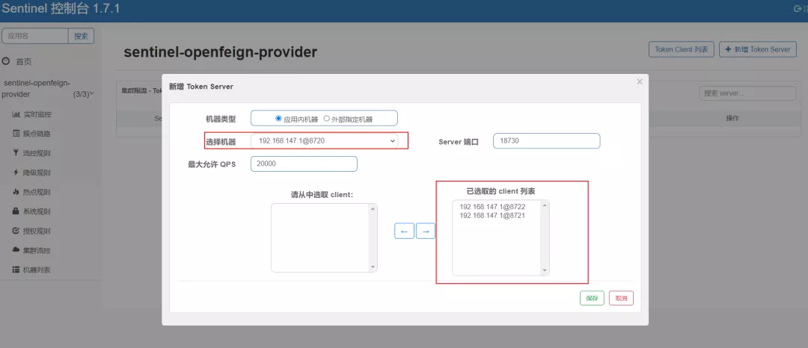

选取一个作为服务端，另外两个作为客户端，此时就已经配置好了，如下图：

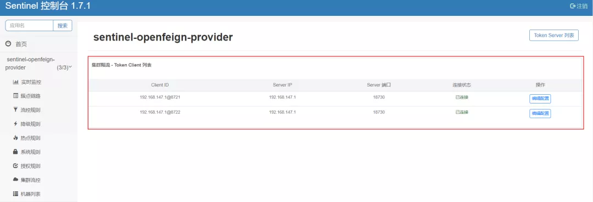

此时就可以添加集群流控规则了，可以在sentinel控制台直接添加，也可以通过Nacos直接配置，下图是通过Nacos配置的，如下图：

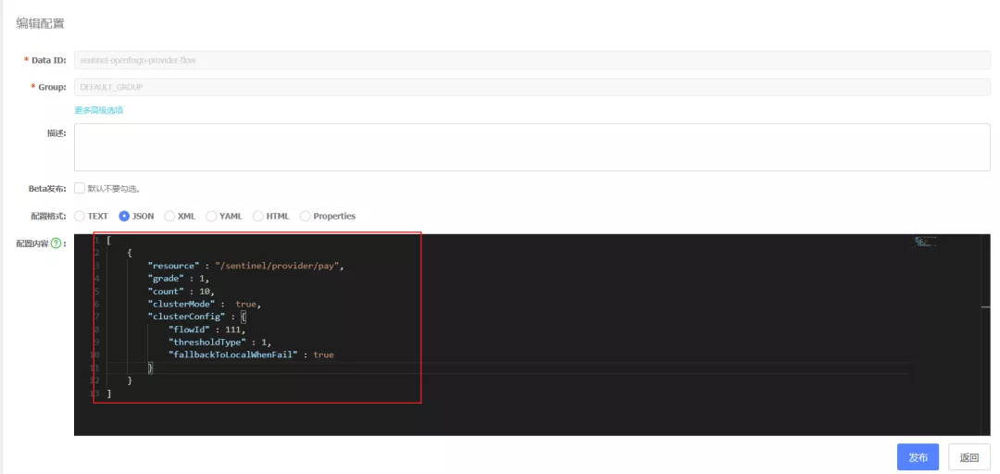

Nacos推送成功后将会在sentinel控制台看到这条流控规则的配置，如下图：

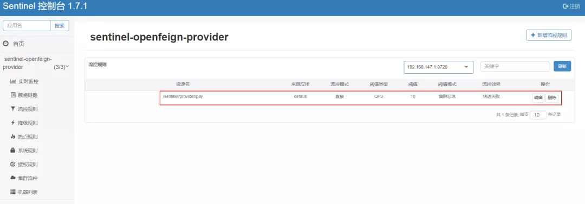

OK，至此集群流控到这儿就介绍完了，配置好之后可以自己试一下效果，陈某就不再演示了。

> 官方文档：https://github.com/alibaba/Sentinel/wiki/%E9%9B%86%E7%BE%A4%E6%B5%81%E6%8E%A7

## 17、网关限流如何配置？

这一块内容在后续介绍到网关的时候会详细讲，这里就不再细说了，有想要了解的可以看官方文档。

> 官方文档：https://github.com/alibaba/Sentinel/wiki/%E7%BD%91%E5%85%B3%E9%99%90%E6%B5%81

## 18、整合openFeign如何实现熔断降级？

这个在上篇openFeign的文章中有详细介绍：[openFeign夺命连环9问，这谁受得了？](https://mp.weixin.qq.com/s?__biz=MzU3MDAzNDg1MA==&mid=2247496653&idx=1&sn=7185077b3bdc1d094aef645d677ec472&scene=21#wechat_redirect)陈某这里就不再重复介绍了，有不知道的可以看上面这篇文章。